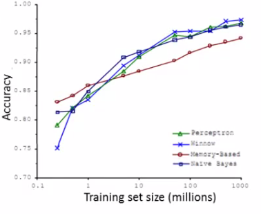

# Machine Learning System Design

## Machine learning systems design

* 시스템을 구성하는 방법
* 이전에서는 다양한 문제를 중점으로 다루었다
* 이번 챕터에서는 덜 수학적이지만 유용한 것들에 대해 다룰 것이다

---

## Prioritizing what to work on - spam classification example

* 우선순위 설정은 개발을 위해서 필요한 가장 중요한 기술 중 하나이다
    - 무엇을 할지에 대해 여러가지 일을 생각하는 것은 매우 쉬운 일이지만, 하나를 잘 하는 것이 여러개를 적당히 하는 것 보다 어려기 때문에 결과가 좋지 못하게 나올 것이다
* spam 분류를 만들어보자
    - spam이란 email 광고이다
* 정의할 features
    - Spam(1)
        + 오타
    - Not spam(0)
        + 실제 내용
* 어떻게 둘을 분류할 것인가
    - x는 어떻게 설정할 것인가
        + y는 spam(1) 또는 not spam(0) 이다

### One approach - choosing your own features
* 메일이 spam인지 아닌지 판단 가능한 단어 100개를 선택한다
    - buy, discount, deal 등이 있으면 spam이다
    - Andrew, now 등은 non spam이다
    - 이런 단어들로 1개의 긴 vector를 만든다
* 이를 reference vector로 encoding한다
    - vector 내의 단어가 들어있는지 확인한다
* Feature vector x를 정의한다
    - reference vector에 있는 단어가 메일에 있으면 1 아니면 0으로 나타낸다
        + 메일에 들어있는 단어에 대한 bitmap이다
* 실제로 자주 나타나는 10,000개에서 50,000개의 단어를 선택한다

### What's the best use of your time to improve system accuracy?
* 많은 data를 수집한다
* 이메일 헤더에 포함된 라우팅 정보를 기반으로 하는 feature 개발
    - spam 발신자는 보낸 사람을 숨기려고 하기도 한다
    - 비정상적인 경로를 통해 보낸다
* 본문 분석을 위한 알고리즘 개발
    - Discount == discoutn
    - DEAL == deal
* 오타를 찾아내는 알고리즘 개발
    - spam 발신자는 일부로 오타를 발생시켜 분류 시스템을 통과한다

### Error analysis
* ML의 문제를 개선해줄 많은 방법이 존재한다
* Machine learning system을 만들 때 빨리 구현할 수 있는 간단한 알고리즘으로 시작하는 것은 좋은 방법이다
    - 초기 bootstraped algorithm을 개발하는데 1일 이상을 소모하지 않기
        + 구현하고 test data와 cross validation data를 test하는 것 포함
    - 더 많은 data나 feature 등이 알고리즘을 개선하기 위해 필요한지 알기 위해 learning curve를 그려본다
        + 어떤 것이 중요한지 예측하는 것은 어렵다
            + Learning curve는 이를 도와준다
    - Error analysis
        + 분류에 오류가 있는 샘플(cross validation set에 있는 것)을 수동으로 분류한다
            + 왜 오류가 생겼는지 분석하기
            + 이를 통해 새로운 feature를 만들 때 도움이 된다
    - 정량적인 평가의 중요성
        + 알고리즘을 정량적으로 평가하는 방법이 있다
        + 알고리즘을 개발할 때 실수 하나로 평가를 하면 해당 알고리즘이 얼마나 잘 작동하는지 알 수 있다
        + 하나의 실수를 만드는 것은 어렵고 복잡할 수 있다
            + 이를 통해 변경사항이 얼마나 영향을 미치는지 확인할 수 있다
    - Test set 대신 cross validation을 사용해 error analysis를 수행해야한다

---

## Error metrics for skewed analysis
* 생각하기 힘든 좋은 오류
* 예시
    - 암 분류문제
        + 암이면 1, 아니면 0을 출력하는 logistic regression model $h_\theta(x)$ 을 만든다
        + Test classifier on test set
            + 1%의 error가 있을 대
                - 괜찮아 보인다
            + 0.5%만이 암이라면
                - 1%는 좋지 않아보인다
    - 분류해야 할 examples의 수가 그렇지 않은 examples보다 훨씬 작을 때 skewed classes 라고 한다
        + 하나의 class가 다른 것들에 비해 훨씬 큰 경우
        + Standard error matrics가 그리 좋지 않다
* 또 다른 예시
    - 알고리즘이 99.2%의 정확성을 가지고 있다
    - 변경을 통해 99.5%의 정확성을 갖게 되었다
        + 이것이 정말 알고리즘의 개선이라고 할 수 있는가
            + error가 매우 적어졌다고 해도 classifier는 여전히 좋지 못하다

### Precision and recall
* precision과 recall이라는 새로운 지표가 있다
    - 둘 모두 0과 1 사이의 값을 갖는다
    - Test set에서의 classifier를 평가한다
    - Test case에서 실질적인 class는 1이나 0이다
    - 알고리즘이 test set의 각각의 example의 value를 예측한다
        + 아래와 같이 분류가 가능하다
            + True positive (예측값 1, 실제값 1)
            + False positive (예측값 1, 실제값 0)
            + True negative (예측값 0, 실제값 0)
            + False negative (예측값 0, 실제값 1)
    - **Precision**
        + 알고리즘이 예측한 것이 얼마나 정확한가
        + 암이라고 예측한 것 중에 실제로 암인 것은 얼마나 되는가
            + = true positive / # of predicted positive
            + = true positive / (true positive + false positive)
        + Precision이 높을수록(1과 가까울 수록) 좋다
            + False positive가 가능한 0에 가까운 것이 좋기 때문
    - **Recall**
        + 알고리즘이 얼마나 sensitive한가
        + 실제로 암인 것 중 암이라고 예측한 것이 얼마나 되는가
            + = true positive / # of actual positive
            + = true positive / (true positive + false negative)
        + Recall 이 높을 수록(1과 가까울 수록) 좋다
            + False negative가 가능한 0에 가까운 것이 좋기 때문
    - Precision과 Recall을 계산하므로써 알고리즘이 얼마나 잘 작동되는지 알 수 있따

---

## Trading off precision and recall

* 많은 applications에서 precision과 recall을 잘 조정하려고 한다
* 예시
    - Logistic regression classifier
        + $h_\theta(x) \geq 0.5$ : predict 1
        + $h_\theta(x) < 0.5$ : predict 0
    - 이 classifier는 적당한 recall값과 precision값을 가지고 있을 것이다
    - Predict 1이 맞을 확률이 높은 경우
        + 이 알고리즘을 바꾸는 방법중 하나는 prediction threshold를 변경하는 것이다
            + $h_\theta(x) \geq 0.8$ : predict 1
            + $h_\theta(x) < 0.2$ : predict 0
        + 이렇게 변경되면 예측이 1일 경우 true positive일 확률이 높아진다
        + Classifier는 더 작은 recall을 갖게된다
            + false negative의 경우가 증가한다
* 또 다른 예시(false negatives를 줄이기)
    - Cancer example에서는 좋지 못하다
        + Lower threshold를 사용한다
            + $h_\theta(x) \geq 0.3$ : predict 1
                - $h_\theta(x) < 0.7$ : predict 0
        + 높은 recall을 얻지만, precision이 낮아진다
            + false positive의 확률이 높아진다
* Threshold를 높이면
    - 암환자라고 진단하는 비율이 낮아진다
        + 암환자인데 정상으로 진단하는 비율이 높아진다
        + 정상인데 암환자라고 진단하는 비율이 낮아진다
        + 암환자라고 진단되면 암환자일 확률이 높아진다
        + 정상이라고 진단되도 암환자일 확률이 높아진다
* Threshold를 낮추면
    - 암환자라고 진단하는 비율이 높아진다
        + 암환자인데 정상으로 진단하는 비율이 낮아진다
        + 정상인데 암환자라고 진단하는 비율이 높아진다
        + 암환자라고 진단되도 정상일 확률이 높아진다
        + 정상이라고 진단되면 정상일 확률이 높아진다

* 어떤 알고리즘이 더 좋다고 판단할 수 있는가
    - 하나의 수치로 나타내면 판단하기 더 좋다
        + 둘의 평균 수치를 사용하지 않는다
            + 항상 y=1이라고 예측해 높은 recall과 낮은 precision을 얻는 classifier가 있을 때
            + 반대로 높은 precision과 낮은 recall을 얻을 때
                - 둘 모두 0.5 이상인 값으로 좋아보이는 값이 나오지만 둘 모두 좋지 못한 threshold이다
* $F_1$ Score(fscore)
    - $\displaystyle 2 \times \frac{P \times R}{P+R}$
        + Fscore는 평균을 구할 때 더 작은 값에 더 높은 가중치를 두는 형태이다
            + P=0, R=0 : Fscore=0
            + P=1, R=1 : Fscore=1
* Threashold는 precision과 recal을 trade-off하며 조정하는 방법이다
* Fscore는 이를 평가하기 위한 하나의 지표이다
    - Threshold를 자동으로 선택하는 방법은 cross validation set을 사용하여 얻을 수 있다
        + Fscore가 가장 좋은 threshold를 선택하면 된다

---

## Data for machine learning

* Training data가 얼마나 필요한가

### Designing a high accuracy learning system

* Data에 다른 알고리즘을 사용하는 연구가 있다
    - Data : 햇갈리는 단어(two, to, too 같은 단어)
    - Algorithms
        + Perceptron(Logistic regression)
        + Winnow
            + Logistic regression과 유사한 알고리즘
            + 요즘엔 거의 사용되지 않음
        + Memory based
            + 요즘엔 거의 사용되지 않음
        + Naive Bayes
            + 추후 살펴볼 예정
    - 다양한 training set의 크기와 다양한 알고리즘 
    
    - 위의 그래프를 통해 알 수 있는 것
        + 알고리즘의 정확성은 비슷하다
        + 많은 data는 도움이 된다
        + 알고리즘을 선택하고 더 많은 data를 주고, 적은 데이터에서도 더 잘 작동하는 알고리즘을 선택해야한다
* x가 y를 예측하기에 충분한 정보를 가지고 있다면 더 많은 data는 도움이 될 것이다
    - 이를 확인하기위한 방법 중 하나는 전문가가 x를 통해 y를 예측할 수 있는지 확인하는 것이다
* 많은 parameter를 가진 learning algorithm이 있다고 가정하자
    - Features의 수가 많은 logistic regression이나 linear regression이나 hidden features가 많은 neural network
        + 복잡한 함수를 fitting할 수 있는 강력한 learning algorithm이다
            + 이들은 low bias algorithm이다
        + 작은 training set을 사용해도 training error는 작을 것이다
        + 큰 training set을 사용하면
            + Training error가 test set erorr와 비슷하다면 
                - Overfitting이 발생하지 않을 는다
                - test set의 error도 작아야 한다
* 알고리즘이 적은 bias와 적은 variance를 갖는 것이 좋다
    - 복잡한 알고리즘을 사용한다 -> low bias
    - 큰 training set을 사용한다 -> low variance

