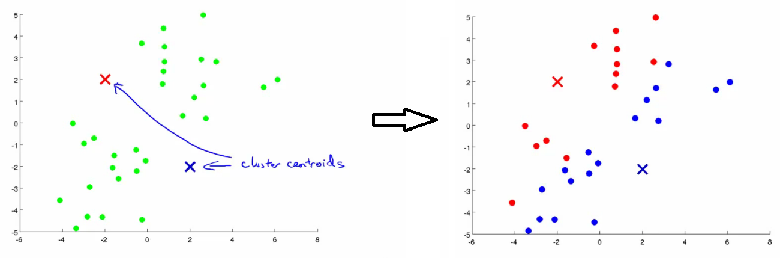
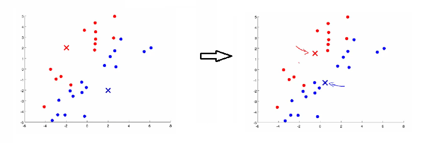
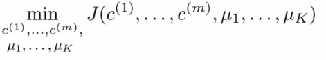

# Clustering

## Unsupervised learning - introduction

* Clustering이란
    - Label되지 않은 data를 통해 학습하는 것
* Unsupervised learning
* Compare and contrast
    - Supervised learning
        + Labeling된 data set을 통해 hypothesis를 만든다
    - Unsupervised learning
        + 주어진 data들 사이의 관계를 얻어내는 것이 목적이다
        + Clustering algorithm
            + 주어진 data를 group으로 묶는다
* Clustering이 유용한 상황
    - Market segmentation
    - Social network analysis
    - Organizing cumputer clusters
    - Astronomical data analysis

---

## K-means algorithm

* K-means는 가장 널리 사용되는 clustering 알고리즘이다

### Overview

* 위의 data를 2개의 그룹으로 분류하기
    1. 임의의 두 위치에 점을 배치한다
        + 분류할 그룹의 수만큼 cluster centroid가 필요하다(k개 필요)
        + 이 예제에서는 2개를 사용할 것이다
    2. Cluster assignment step
        + 각 점에서 더 가까운 cluster centroid에 해당하는 색상으로 변경한다
        + 모든 data가 빨간색 또는 파란색 점으로 표현될 것이다  
        
    3. Move centroid step
        - 각각의 cluster centroid를 cluster의 평균지점으로 옮긴다
        - cluster centroid가 수렴할 때 까지 2, 3을 반복한다
        
* Formal definition
    - input:
        + K
            + number of clusters in the data
            + $\mu_1, \mu_2, \mu_3, \dots, \mu_k$
        + Training set
            + $x^1, x^2, x^3, \dots , x^n$
    - algorithm:
        + K개의 cluster cetroids를 무작위로 초기화한다 
            
            + Loop 1
                - $c^{(i)}$ 를 $x^{(i)}$ 에서 가장 가까운 cluster centroid의 index로 설정한다
                    * $\displaystyle \min_k ||x^{(i)} - \mu_k||^2$
                    * $c^{(i)} := k$
            + Loop 2
                - 각각의 cluster centroid를 $c^{(i)} = k$ 인 x의 평균으로 설정한다
        + 어떤 것에도 선택되지 않은 Centroid가 있다면
            - 삭제한다
            - 무작위로 초기화하여 다시 수행한다

### K-means for non-separated clusters

* 위의 예제에서는 cluster의 정의가 간단했다
    - 그렇지 않은 경우가 존재한다
        + 티셔츠 사이즈  
* 위의 경우 명확하게 구분하기 힘들다
* 사이즈를 S, M, L 3개로 분류한다면 다음과 같이 분류될 것이다

---

## K-means optimization objective

* Supervised learning 알고리즘은 cost function을 최소화 한다는 optimization objective가 존재한다
    - K-means도 존재한다
* K-means의 optimization objective는 supervised learning에서 본 것과 비슷하다
    - 이것을 알고있으면 디버깅에 도움이 된다
    - 더 나은 cluster를 만들 수 있다
* K-means는 2개의 variable set이 있다
    - $c^{(i)}$
        + $x^i$ 가 어떤 cluster에 속하는지에 대한 index(1~K의 범위)
    - $\mu_k$
        + k번째 cluster centroid의 training data space 상의 좌표
    - $\mu_{c^{(i)}}$
        + i번째 data set이 속한 cluster의 centroid의 좌표
            + $x^i$ 가 5번 cluster에 속한다면
                - $c^{(i)} = 5$
                - $\mu_{c^{(i)}} = \mu_5$
* 이를 사용하여 다음과 같은 optimization objective를 만들 수 있다  
    
    - 이 식은 $x^i$ 와 $x^i$ 가 속하는 cluster의 centroid 사이의 거리들의 평균을 구하는 식이다
        + 이는 cluster에 속한 examples의 거리가 가까울 수록 값이 작아진다는 것을 의미한다
    - 이를 distortion 혹은 distortion cost function이라고 부른다
    - 이 cost function을 최소화하도록 만들어야 한다  
    
* 위의 식을 2개로 나눠볼 수 있다
    1. Cluster assigned step
        + $c^{(1)}, c^{(2)}, \dots, c^{(i)}$ 값(index)을 변화시켜 J()를 최소화한다
    2. Move centroid step
        + $\mu_1, mu_2, \dots, \mu_K$ 값(좌표)을 변화시켜 J()를 최소화한다
* 이를 사용해서 K-means 알고리즘을 디버깅할 수 있다

### Random initialization
* K-means를 어떻게 초기화 하는가
    - 어떻게 local optimum을 피하는가
* K-means는 초기 값에 따라서 다른 값으로 수렴할 수 있다
    - Local optimum에 빠질 위험이 존재한다  
    
* 이를 해결하기 위해 여러개의 초기화 값을 만들 수 있다
    - 많은 초기값에서 수렴한 centroid가 global obtimum일 가능성이 높다

* 보통 50~1000 사이의 횟수를 반복한다

---

## How do we choose the number of clusters?

* K값 선택하기
    - 자동으로 선택하는 것은 그리 좋은 방법이 아니다
    - 시각화 해서 직접 설정하는 것이 일반적이다
* 왜 K값을 선택하는 것이 어려운가
    - 매우 애매하다
        + 항상 옳은 정답이 없다
        + 분류를 할 때 몇개로 할지 알기 힘들다

### Elbow method

* K가 증가하면 대체로 J()가 감소한다
    - 중간에 증가하게 된다면 최소값이 되는 K가 더 좋은 optimum일 것이다
* 아래의 graph에 꺽이는 "elbow" 지점이 있다 

* Elbow 지점의 K값을 선택하는 것은 의미있는 방버이다
    - 단점
        + 완전히 꺽이는 지점이 있는 것이 아니라 완만한 곡선을 그린다면 해당 값을 찾을 수 없다

### Another method for choosing K

* 원하는 clusters의 수 만큼 K를 설정하는 방법이 있다
* 예시 - 티셔츠 분류
    - 티셔츠의 사이즈를 S,M,L 3가지로 분류할 수도 있고, XS,S,M,L,XL 같이 5개로 분류할 수도 있다
