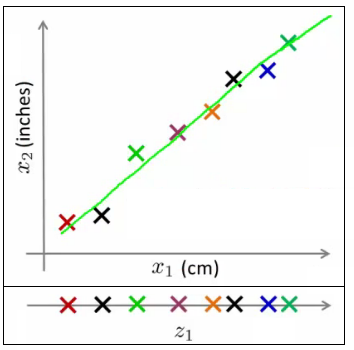
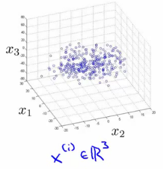
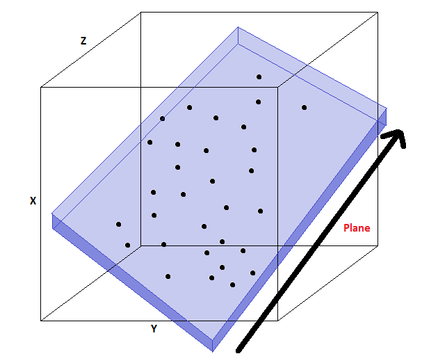
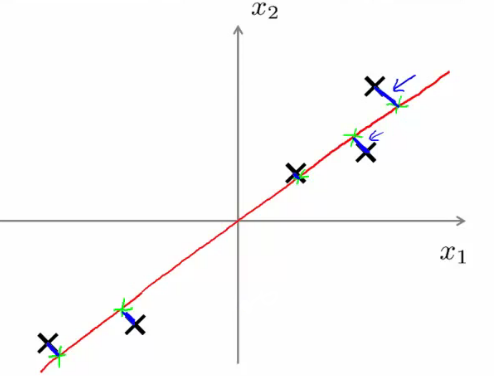

# Dimensionality Reduction(PCA)

## Motivation 1: Data compression

* Dimensionality reduction이라는 unsupervised learning의 또 다른 예시
    - 무슨 장점이 있는가

### Compression
* 알고리즘의 속도가 증가한다
* Data를 표현하기 위해 필요한 공간이 줄어든다
* Dimensionality reduction이란 무엇인가
    - Data를 표현하기 위한 많은 feature가 있다
        + 이 feature를 줄일 방법은 무엇이 있는가
    - 예시
        + 같은 속성(길이)를 표현하는 다른 단위를 사용하여 표현한 예시
        + Data를 2D에서 1D로 변경한다
        + 아래의 예시중 2D는 반올림 때문에 완전한 직선이 아니다  
        
    - 서로 독립적인 항에 대해서도 가능하다
        + Data를 수집할 때 별도의 제한사항이 없을 경우 중복이 자주 발생한다
* Dimensionality reduction이 의미하는 바는 무엇인가
    - 위의 예시의 경우 직선으로 표현이 가능하다
    - 변경 전에는 2D feature였지만 변경한 뒤에는 1D feature이다
* 원본 data에서 근사 해야한다
    - 손실 허옹 범위 내의 손실 압축을 지원한다
        + 이 경우에는 측정과정에서 반올림에 의해 나타난 loss이다
* 3D to 2D 예시 
    
    - 모든 data가 한 평면 상에 놓여있을 수도 있다
        + 이를 2D로 표현하는 것을 힘들 수도 있다
            + 한 축에 대하여 정렬되어 있을 수도 있고 아닐 수도 있다
            + 해당 평면은 작고 일정한 3차원의 공간이다
        + 아래에는 파란 6면체 안에 모든 data point가 들어있는 형상을 보여준다  
            

---

## Motivation 2: Visualization

* 고차원의 data는 시각화 하기 어렵다
    - Dimensionality reduction을 통해 인간이 이해하기 쉽고 다루기 쉬운 상태로 정보를 가공할 수 있다
    - 필요한 이유
        + 알고리즘을 잘 만들기 위해서는 data를 잘 이해할 필요가 있다
           + 이런 관점에서 dimensionality reduction은 data를 이해하기 위해 도움이 된다
* Example
    - 각 국가에 대한 정보들  
        
        + $x_1$ : GDP
        + $x_2$ : per capital GDP
        + $\dots$
        + $x_6$ : mean household
    - 각 국가 마다 50개의 feature가 있다면
        + 50차원의 그래프는 만들고 이해하기 어려울 것이다
            + 어떻게 data를 더 잘 이해할 수 있을까
        + Feature의 수를 줄이면 더 이해하기 쉬워진다
            + 새로 만들어진 feature가 기존의 feature가 표현하는 정보를 담고 있어야 한다

---

## Principle Component Analysis(PCA): Problem Formulation

* Dimensionality reduction을 수행하는 가장 기본적인 방버버은 PCA이다
* 2D data를 1D로 reduce하는 예시
    - 이는 하나의 직선으로 data를 표현한다는 뜻이다
        + 어떻게 직선을 만드는가
            + 점과 직선과의 거리가 작아야 한다
            + PCA는 저차원의 serface를 찾기 위해 해당 serface의 sum of squares를 사용한다
            + 아래의 파란 선분을 projection error라고 부르기도 한다
                - PCA는 projection error를 최소화하는 serface를 찾는다  
                
            + 추가적으로 PCA를 적용하기 이전에 data를 mean normalization과 feature scaling을 해야한다
* 정리하자면 2D to 1D PCA는 projection error를 최소화하는 vector $u^{(1)}$ 을 찾는 것이다  

* in the more general case
    - nD에서 kD로 reduce
        + projection error를 최소화하는 k개의 벡터 $(u^{(1)}, u^{(2)}, \dots, u^{(k)})$ 를 찾아야한다
        + 찾아낸 백터를 포함하는 linear subspace에 data를 투영한다
            + k개의 벡터로 이뤄진 평면에 point를 정의한다
* PCA와 linear regression의 관계
    - PCA는 linear regression이 아니다
        + 겉으로 보기에는 비슷해 보이지만 매우 차이가 있다
    - Linear regression
        + point와 squared line의 **VERTICAL distance**를 최소화 한다
            + vertical distance : y값의 차
    - PCA
        + point와 straight line의 **orthogonal distance**를 최소화 한다
            + Orthogonal distance : 선과 점 사이의 수직 거리(가장 짧은 거리)
    - Linear regression은 y를 예측한다
    - PCA는 y를 예측하지 않는다

---

## PCA Algorithm

* PCA를 적용하기 전에 data preprocessiong이 반드시 필요하다
    - Mean normalization
        + 각 $x_j^i$ 를 $x_j - \mu_j$ 로 변경한다
            + $\mu_j$ : 평균
            + 평균을 원점(2D의 경우 (0,0))으로 이동한다
    - Feature scaling
        + 각 $x_j^i$ 를 $\displaystyle \frac{x_j - \mu_j}{s_j}$ 로 변경한다
            + 표준편차를 의미한다
* 전처리가 끝나면 PCA를 통해 projection error를 최소화하는 낮은 차원의 sub-space를 찾아낸다
    - 두가지를 계산해야한다
        + u vector
            + 새로운 평면
        + z vector
            + lower dimensionality feature vector
* u vector를 계산하는 수식은 복잡하지만, 각각의 u vector를 구하는 것이 그렇게 어렵지는 않다

### Algorithm description

* Data를 n-차원에서 k-차원으로 reducing한다
    - Covariance matrix 계산 
        
        + $\Sigma$
            + 대문자 sigma로 sigmation symbol이 아니다
            + $[n \times n]$ matrix이다
                - $x^{(i)}$ 는 $[n \times 1]$ matrix이다
    - Compute eigenvectors of matrix $\Sigma$
        + [U, S, V] = svd(sigma)
            + svd: singular value decomposition
                - eigenvector보다 수학적으로 안정적이다
    - U, S, V는 모두 matrix이다
        + U matrix
            + $[n \times n]$ matrix
            + U의 column vector가 u vector이다
                - u vector = eigenvector
        + n-차원에서 k-차원으로 축소하기 위해서는 U Matrix의 앞의 k개를 선택하면 된다
            
* n-차원에서의 x를 k-차원의 z로 바꾸는 방법이 필요하다
    - U Matrix의 앞의 K개 column을 선택해서 쌓는다
        + 이렇게 만들어진 $[n \times k]$ Matrix를 $U_{reduce}$ 라고 한다
    - z는 다음과 같이 계산한다
        + $z = (U_{reduce})^T \times x$
            - $[k \times n] \times [n \times 1]$
            - 연산 결과는 $[k \times 1]$ Matrix이다
* Unlabeled data를 사용하는 것을 제외한다면 supervised learning과 동일하다
* 요악
    - Preprocessing
    - Calculate sigma(covariance matrix)
    - Calculate eigenvectors with svd
    - Take k vectors from U
    - Calculate z $(z = U_{reduce}^T \times x)$

---

## Reconstruction from Compressed Representation

* PCA는 compression algorithm이다
    - 이번 것은 고차원으로 decompress하는 방법에 대한 것이다
* Reconstruction
    - 예시  
    
    - z-surface로 투영한 것이다
    - $z_1$ 을 2D 공간상으로 되돌릴 수 있ㄴ느가
* $\overrightarrow{z} = (U_{reduce})^T \times x$
* U Matrix는 orthogonal이므로 $x_{approx} = U_{reduce} \times z$ 이다
* 이 과정을 통해 아래와 같은 2D space를 얻을 수 있다  

* Compress 과정에서 발생한 projection error 때문에 원래의 정보중 일부가 손실된다

---

## Choosing the number of Principle Components

* k를 어떻게 선택할 것인가
    - k: principle components의 수
* PCA의 동작을 생각하면 어떻게 k를 고를지 알 수 있다
    - PCA는 projection error을 최소화한다
        + $\displaystyle \frac{1}{m} \sum_{i=1}^m ||x^{(i)}-x_{approx}^{(i)}||^2$
    - Data의 총 변화량은 training examples의 평균이 원점에서 얼마나 떨어졌는가로 정의할 수 있다
        + $\displaystyle \frac{1}{m} \sum_{i=1}^m||x^{(i)}||^2$
* k를 선택하기 위해서 아래와 같은 수식을 사용한다 
    
    - Total variation당 projection error의 평균의 비율이다
        + 이 값이 작기를 원한다
    - 이 값이 작아진다면 이는 분자가 작기 때문이다
        + 분자가 0이 되는 경우는 $x^i = x_{approx}^i$ 일 때이다
            + Dimensionality reduction에서의 loss가 매우 작을 경우 decompress를 했을 때 원본과 거의 동일한 data를 얻을 수 있다
* 분산을 유지한 상태로 data의 차원을 줄이는 것은 자주 있을 수 있다

---

## Advice for Applying PCA

* 알고리즘을 빠르게 동작하기 위해서 PCA를 사용할 수 있는가

### Speeding up supervised learning algorithms

* Supervised learning에 대해 생각해보자
    - x와 y가 입력으로 들어온다
        + x가 10,000차원 feature vector이다
            + 100 $\times$ 100 이미지는 10,000픽셀이다
        + 이런 큰 크기의 input은 알고리즘을 느리게 만든다
    - PCA를 사용하면 더 다루기 쉽도록 차원을 낮출 수 있다
    1. x를 추출한다
        + Unlabeled training set을 얻는다
    2. x vectors에 PCA를 적용한다
        + Reduced dimensinal feature vector z를 얻는다
    3. 새로운 training set을 얻는다
        + 각 백터를 label과 다시 연결한다
    4. Reduced dimensionality data set으로 알고리즘을 학습시킨다
        + Label은 y, feature vector는 z를 사용한다
    5. 새로운 training set이 있다면 마찬가지로 higher dimensionality vector를 lower dimensionality  vector로 mapping해서 알고리즘 학습에 사용한다
* PCA는 백터를 lower dimensionality 백터로 변환한다
    - x $\rarr$ z
    - Training set에 의해서만 PCA를 정의한다
    - Parameters의 set을 계산한다
        + Feature scaling values
        + $U_{reduce}$
            + PCA에 의해 얻어진 parameter
            + Training set을 통해 PCA를 정의해야 얻을 수 있다
    - 이렇게 얻어낸 parameter를 다음 경우에도 사용할 수 있따
        + Cross validation data
        + Test set
* 알고리즘에 큰 타격 없이 data dimensionality를 5-10배 정도 줄일 수 있다

---

## Applications of PCA

* Compression
    - 사용 이유
        + Data를 저장할 메모리나 저장장치를 줄이기 위해서
        + 학습 알고리즘의 속도를 높이기 위해
    - 어떻게 k를 선택할 것인가
        + 분산이 유지되는 비율
* Visualization
    - 보통 k를 2나 3으로 선택한다
        + 그래프로 표현하기 위해서
* PCA를 잘못 적용하는 예
    - Overfitting을 방지하기 위해 사용한다
        + 이유
            - $x^i$ 에 비해 $z^i$ 는 feature의 수가 적다
            - $z^i$ 의 feature는 k개이므로 수가 적어 보여서 overfitting을 피할 수 있다고 생각할 수 있다
        + 이렇게 동작하지 않는다
            - 동작할 가능성이 없지는 않지만 별로 좋은 방법은 아니다
            - Regularization을 사용하는 것이 더 좋다
        + PCA는 어떤 값이 loss되는지 모르는 상태로 data를 버리게 된다
            - 거의 모든 data를 지킬 수 있는 경우에는 좋을 것이다
            - 중요한 data를 버리게 된다면 좋지 못할 것이다
    - ML system을 설계할 때 PCA를 사용한다
        - PCA가 없어도 동일한 작업이 가능하다
        - PCA가 적용되면 좋은 것에 대한 이유가 있을 때만 PCA를 추가해야한다
        - PCA는 진행 도중에 언제든 쉽게 추가할 수 있기 때문에 처음부터 PCA를 사용하는 것은 피하는 것이 좋다