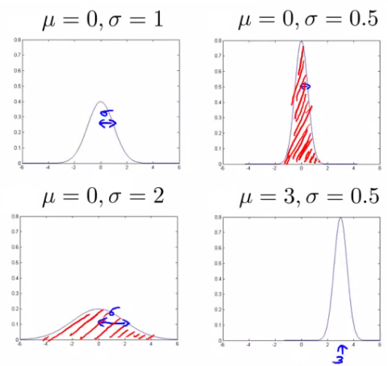
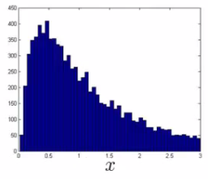
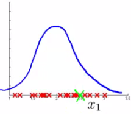

# Anomaly Detection

## Anomaly detection: problem motivation

* Anomaly detection은 합리적이고 일반적으로 사용되는 ML application이다
    - Unsupervised learning problem의 solution이라고 생각할 수 있다
    - Supervised learning의 면모를 가지고 있다
* Anomaly detection이란
    - 항공기 엔진 제조업자라고 생각해보자
    - 발열정도, 진동 발생 등 엔진에 대해 측정 가능한 부분이 있을 것이다
        + 엔진을 테스트 하기 위한 m개의 dataset $(x^1, x^2, \dots,   x^m)$ 이 있을 것이다
    - 이를 아래와 같이 그래프로 표현할 수 있을 것이다  
    
    - 다른 엔진을 만들어 냈다면 해당 엔진을 테스트 할 것이다
        + Anomaly detection  method는 이전에 엔진들에 대한 test 값과 비교하여 새로운 엔진이 anomalous한지 보여준다
    - 만약 새로운 엔진이 다음과 같다면 아마 괜찮을 것이다
        + 이전의 엔진들과 크게 다르지 않다  
        
    - 하지만 새로운 엔진이 다음과 같을 수도 있다
        + 이 경우에는 Anomalouse data-point로 보인다
        
* More formally
    - 기존에 normal data가 포함된 dataset이 있다
        + 해당 dataset이 normal한지는 알아서 정하면 된다
        + Normal하지 않은 data가 몇개 섞여 있어도 괜찮다
    - 이 dataset을 기준으로 다른 data가 anomalous한지 판별할 수 있다
* 어떻게 해야하는가
    - Training dataset을 통해 모델을 만든다
        + p(x)를 사용하여 모델에 접근할 수 있다
            + 이는 x가 normal할 가능성을 예측한다
    - 모델 구축
        + if $p(x_{test}) < \epsilon$ : anormal
        + if $p(x_{test}) \geq \epsilon$ : normal
        + $\epsilon$ : threshold
    - 모델을 그래픽적으로 표현한다면 아래와 같이 표현되는 것이 이상적이다  
    

### Applications

* <u>**Fraud detection**</u>
    - 유저들은 다음과 관련된 활동을 가진다
        + On-line인 시간의 길이
        + Login한 지역
        + 접속 빈도
    - 이를 토대로 평번한 유저가 어떻게 행동하는지에 대한 모델을 만들 수 있다
    - "Normal"한 행동일 확률이 얼마인가
    - 모델을 통해 정상적이지 않은 행동을 하는 유저를 식별한다

* <u>**Manufacturing**</u>
    - 항공기 엔진문제가 이 분류에 해당한다

* <u>**Monitoring computers in data center**</u>
    - 컴퓨터가 많이 있는 경우 각 컴퓨터의 상태를 다음과 같이 측정할 수 있다
        + $x_1$ : 메모리 사용량
        + $x_2$ : 초당 disk 접근 수
        + $x_3$ : CPU 사용량
    - 여기에 조금 더 복잡한 features를 정의할 수 있다
        + $x_4$ : 네트워크 traffic당 CPU의 사용량
    - 비정상적인 작동을 하는 장치를 식별할 수 있다

---

## The Gaussian distribution(optional)

* Gaussian distribution은 정규분포라고도 부른다
* 예시
    - 실수로 이루어진 data set x를 가정하자
        + $\mu$ 는 평균이다
        + $\sigma^2$ 은 분산이다
            - $\sigma$ 는 표준편차라고도 불린다
        + 이 data가 gaussian 분포를 가진다고 하자
    - 이 data set을 $\sim N(\mu, \sigma^2)$ 라고 표현할 수 있다  
    
    - 이 그래프는 x가 해당 값을 가질 확률을 의미한다
* Gaussian equation은 다음과 같다
    - $\displaystyle P(x: \mu, \sigma^2) = \frac{1}{\sqrt{2\pi\sigma}}\exp\left(-\frac{(x-\mu)^2}{2\sigma^2}\right)$
* Gaussian의 여러 예시
    - 총 면적은 항상 1이다
    - 표준편차가 바뀌면 넓이는 바뀐다  
    

### Parameter estimation problem

* Parameter estimation problem이 무엇인가
    - m개의 examples가 있는 dataset이 있다고 가정하자
    - 이 examples는 실수이고, 이를 나타내면 아래와 같이 표현할 수 있다  
    
    - 이 examples가 Gaussian 분포를 따르는 것 처럼 보이고, 이를 아래와 같이 표현할 수 있다  
    
    - 중앙에 가까울 수록 데이터이 분포가 높고, 멀어질수록 낮아지므로 Gaussian으로 표현하기에 적합해보인다
* $\mu$ 와 $\sigma^2$ 값 구하기
    - $\mu$ : examples의 평균
    - $\sigma^2$ : 표준 편차의 제곱
        * $\displaystyle \sigma^2 = \frac{1}{m} \sum_{i=1}^m (x^{(i)} - \mu)^2$

---

## Anomaly detection algorithm

* m개의 examples가 있는 unlabeled training set이 있다
    - Data = $\{x^1, x^2, \dots, x^m\}$
        + 각각의 examples는 n-차원 feature vector이다
    - Model P(x)
        + 확률이 가장 높은 feature와 가장 낮은 feature는 무엇인가
        + x는 벡터이다
        + 그러므로 model p(x)는 다음과 같은 형태일 것이다
            + $p(x) = p(x_1; \mu_1, \sigma_1^2)*p(x_2; \mu_2, \sigma_2^2)* \dots* p(x_n; \mu_n, \sigma_n^2)$
        + 각각의 feature의 probability를 곱한다
            + Features가 Gaussian 분포를 따른다는 가정 하에 모델을 만든다
            + $p(x_i; \mu_i, \sigma_i^2)$
    - p(x)를 다시 정리하면 아래와 같이 정리할 수 있다
        + $\displaystyle \prod_{j=1}^{n} p(x_j; \mu_j; \sigma_j^2)$
            + 대문자 Pi $(\Pi)$ 는 set의 각 값의 곱셈을 의미한다
    - 이런 문제를 density estimation이라고 부르기도 한다

### Algorithm

1. Chose features
    - Anomalous한 값을 찾아내기 위한 feature를 선택한다
        + Anomalous한 값은 비정상적으로 크거나 작을 수 있다
    - General properties를 설명하는 feature를 선택한다
    - 이 과정은 Anomaly detection에 국한되는 것이 아닌, 일반적으로 더 좋은 feature vector를 만들기 위한 방법이다
2. Fit parameters
    - 각각의 examples의 $\mu_i$ 와 $\sigma_i$ 에 대한 parameter를 결정한다
        + Fit이라기 보다는 Calculate parameters for 1 to n 이라고 표현하는 쪽이 더 맞다
    - 각각의 feature의 평균과 표준편차를 계산해야한다
    - Loop으로 하는 것이 아니라 vector로 구현하여 한번에 update 해야한다
3. Compute p(x)
    - Gaussian 확률을 계산한다
    - 계산 결과가 너무 작다면 정상일 확률도 매우 적다

### Anomaly detection example
* $x_1$
    - 평균이 5이고, 표준편차가 2이다
* $x_2$
    - 평균이 3이고, 표준편차가 1이다
* 이는 다음과 같이 나타낼 수 있다  
    
* $x_1$ 과 $x_2$ 의 Gaussian을 그래프로 나타내면 다음과 같다  
    
* 이를 3차원 상에 표현한다면 다음과 같다  
    
    - 이 surface plot의 표면의 높이가 p(x)의 확률이다
    - 항상 surface plot을 그릴 수는 없지만 이 경우에는 surface plot을 만드는 것이 이해하기 좋은 방법이다
* Value가 anomalous한지 확인
    - ε = 0.02
    - $x_{test}^1$ = (4,4)
    - $x_{test}^2$ = (7,1)

* $x_{test}^1$
    - $p(x_1)$ = 0.17
    - $p(x_2)$ = 0.25
    - $p(x_{test}^1)$ = 0.17 * 0.25 = 0.0425 $\geq \epsilon$
    - Normal
* $x_{test}^2$
    - $p(x_1)$ = 0.1
    - $p(x_2)$ = 0.02
    - $p(x_{test}^1)$ = 0.1 * 0.02 = 0.0002 $< \epsilon$
    - Anormal

---

## Developing and evaluating and anomaly detection system

* Anomaly detection system을 평가하는 방법
* 실수로써 평가하는 것은 중요하다
    - 선택지가 매우 다양하다
        + 변화된 것에 의한 알고리즘의 성능의 증가와 감소에 대해 하나의 숫자로 표현이 가능하면 성능을 평가하기에 더 좋다
    - 알고리즘을 평가할 방법이 있는 것은 anomaly detection system을 더 빠르게 설계하는 것에 도움이 된다

### Engine example

* Labeled data가 있다고 가정하자
    - 이전까지는 unlabeled data를 통해 anomalous detection을 학습해왔다
    - Labled data가 평가가 가능한 경우
        + Anomal 한지 아닌지 알 수 있다
* Engine example
    - Non-anomalous한 경우는 0, anomalous한 경우는 1로 label된 data가 있다
    - Training set은 normal examples 집합이다
        + Anomalous data가 조금 포함되어도 괜찮다
    - 이후에는 Cross validation set, Test set을 정의한다
        + 이 또한 anomalous data가 조금 포함되어도 괜찮다
* Specific example
    - 엔진
        + 10,000개의 성능이 좋은 엔진이 있다
            + 이들중 성능이 떨어지는 엔진이 1개 있어도 괜찮다
            + 대다수는 y=0이다
        + 20개의 결함이 있는 엔진
            + 보통 y=1이 2-50개정도이다
    - 분배
        + Training set: 6,000개의 정상적인 엔진
        + CV set: 2,000개의 정상적인 엔진, 10개의 anomalous 엔진
        + Test set: 2,000개의 정상적인 엔진, 10개의 anomalous 엔진
        + 비율은 3:1:1이다
    - Algorithm evaluation
        + Take trainings set { $x^1, x^2, \dots, x^m$ }
        + CV, test set으로 example x를 test한다
            + $p(x) < epsilon$ : y=1(anomlous)
            + $p(x) \geq epsilon$ : y=0(anomlous)
        + 이 알고리즘은 어떤 것이 anomalous한지 예측하는 것 처럼 동작한다
            + 이는 supervised learning처럼 보인다
* 평가하기 좋은 방법은 무엇인가
    - y=0이 너무 많다(skew)
    - F1-score를 계산해야한다

---

## Anomaly detection vs. supervised learning

* Labeled data가 있다면 supervised learning을 활용해도 된다
    - Anomaly detection과 supervised learning을 각각 어떤 상황에 활용하면 좋은지에 대해 알아보자

### Anomaly detection
* Positive examples의 수가 매우 적을 때
    - CV와 test set에서만 positive exammples를 사용한다
        + Positive examples가 무엇인지 학습할 수 있는 충분한 data가 없다
* Negative examples의 수가 매우 많을 때
    - 이를 활용하여 p(x)를 fitting한다
        + Negative examples만 있어도 된다
* Anomal한 것이 매우 다양할 때
    - Anomal한 것이 다른 성질을 나타낼 때 positive examples를 학습하는 것이 쉽지 않다
        + Anomaly detection은 어떤것이 anomal한지를 아는 것이 아니라 어떤것이 anomal하지 않은지를 안다
    - SPAM email의 경우
        + SPAM의 종류는 많다
        + SPAM의 경우 positive examples의 수가 충분히 많다
        + 때문에 이 경우에는 supervised learning을 활용해도 된다
* Application and why they're anomaly detection
    - Fraud detection
        + 사기의 유형은 다양하다
        + 온라인 사기 같은 흔히 있는 사기의 경우에는 supervised learning을 활용해도 된다
    - Manufacturing
        + 규모가 매우 큰 경우에는 충분한 positive data가 있기 때문에 supervised learning으로 만들어도 된다
            + 어떤 종류의 error가 발생할지 예측한다는 의미이다
            + 우리는 무지한 것을 좋아하지 않는다
    - Monitoring machines in data

## Supervised learning
* 상당히 많은 수의 positive and negative examples가 필요하다
* 많은 positive examples를 제공해야 그들 사이의 관계를 파악할 수 있따
    - 만약 anomaly의 종류가 여럿이라면 각각의 anomaly에 대해서 많은 examples를 제공해야 한다
* Application
    - Email/SPAM classification
    - Weather prediction
    - Cancer classification

---

## Choosing features to use

* 어떤 features를 사용하는지는 큰 영향을 미치는 요인중 하나이다
* Non-Gaussian features
    - Data를 히스토그램으로 나타냈을 때 Gaussian 분포의 형태를 하고있는지 확인하는 것은 괜찮은 선택이다
        + 종종 data가 non-Gaussian인 경우가 있다
    - Non-Gaussian의 경우 아래와 같을 것이다  
        
    - 다른 함수를 사용하는 것으로 data를 Gaussian처럼 보이게 바꿀 수 있다
    - 이 경우에는 log를 사용하여 $x_1$ 을 $\log x_1$ 으로 바꿔볼 수 있다  
        
        + 이렇게 바꾸면 조금 더 Gaussian처럼 보인다
    - $\log(x_1 + c)$ 를 사용해도 된다
    - $x^\frac{1}{2}$ 혹은 $x^\frac{1}{3}$ 을 사용해도 된다

### Error analysis for anomaly detection

* Features를 선택하는 좋은 방법
* Supervised learning erorr analysis처럼 하면 된다
    - CV set을 만들어서 활용한다
    - 어떤 feature가 틀렸는지 확인한다
    - 왜 오류가 발생했는지를 분석해서 새로운 feature를 만든다
* Example
    - p(x)가 큰 경우 normal, p(x)가 작은 경우 abnomal  
    
    - 1차원 상에서 나타낼 경우 anomalous 값이 중간에 존재한다
        + 이를 분석해서 새로운 feature를 개발하면 anomalous한 data를 구분해낼 수 있을 것이다
* Example - data center monitoring
    - features
        + $x_1$ : 메모리 사용량
        + $x_2$ : 초당 disk 접근 수
        + $x_3$ : CPU 사용량
        + $x_4$ : 네트워크 traffic
    - 네트워크 traffic과 cpu 사용량에는 상관관계가 있을 것이다
        + Server의 경우 users가 늘어나면 네트워크 traffic이 증가하고 cpu사용량도 증가할 것이다
        + 무한 loop에 빠지게 되면 cpu사용랑은 증가하지만 네트워크 traffic은 낮을 것이다
            + 새로운 feature가 필요하다
                - 네트워크 traffic당 CPU 사용량

---

## Multivariate Gaussian distribution

* Non-multivariate Gaussian distribution가 식별할 수 없는 anomalies를 식별할 수 있는 조금 다른 기술이다
    - 다음과 같은 unlabeled data가 있다  
        
    - CPU 사용량과 메모리 사용량이 Gaussian 분포를 따른다고 가정하자
    - $x_1 = 0.4, x_2 = 1.5$ 인 anomaly 값이 있다고 가정하자
        + 2차원 상에서는 대부분의 data가 이 anomaly 값에서 멀리 떨어진 것으로 보인다
            + 메모리 사용량은 높고, CPU 사용량은 낮다
    - 문제는 각각의 feature에 대해서 독립적으로 판별하면 두 값 모두 정상 범위 내에 있다는 것이다
    - 이런 문제가 발생하는 원인은 아래의 분홍색 원처럼 예측 범위를 만들기 때문이다  
        
        + 초록색 X가 anomaly 인것을 확인할 수 있지만 기존의 함수 상으로는 빨간 동그라미의 두 값은 같은 확률을 가지게 된다

### Multivariate Gaussian distribution model

* 이런 문제를 해결하기 위해서 multivariate Gaussian distribution가 필요하다
    - 각 feature에 대해서 개별로 생각하는 것이 아닌 하나로 생각한다
        + 이 model의 parameters는 다음과 같다
            + $\mu$ : n차원 백터(n개의 feature가 포함됨)
            + $\Sigma$ : $[n \times n]$ Matrix
                - Convariance matrix
* Multivariate Gaussian distribution은 다음과 같다  
    
    - $|\Sigma|$
        + $\Sigma$ 의 절대값
            + determinant of sigma
* p(x)는 어떻게 생겼는가
    - 2D exampe  
          
        
        + p(x)는 위와 같이 생겼고, 표면의 높이가 p(x)값이다
    - Sigma의 값이 변하면 어떻게 변하는가  
          
        
        + 더 높고 뽀족한 결과물이 생성된다
    - x_1만을 변화한다  
        
    - 0으로 고정된 부분 변화  
        

---

## Applying multivariate Gaussian distribution to anomaly detection

* Multivariate Gaussian modeling은 다음과 같은 수식을 사용한다  
    
* $\mu$ 와 $\Sigma$ 에 대한 해설
    - $\mu$ : n차원 백터로 평균값을 의미한다
    - $\Sigma$ : $[n \times n]$ 차원의 covariance matrix(공분산 행렬)
* Parameter fitting/estimation problem
    - ${x^1, x^2, \dots, x^m}$ 의 examples set이 있을 때 다음과 같은 식으로 $\mu$ 와 $\Sigma$ 를 계산한다  
        

### Anomaly deteciton algorithm with multivariate Gaussian distribution
1. Fit model
    - Dataset으로 $\mu$와 $\Sigma$ 를 계산한다
2. 주어진 $x_{test}$ 를 p(x)를 통해 계산한다
3. $\epsilon$ 과 비교하여 결과를 도출한다
* Multivariate Gaussian model을 잘 fitting했다면 아래와 같은 결과를 얻을 수 있다  
    
* 이는 초록색 값이 anomalous라는 뜻이다
* 마지막으로 기존의 Gaussian model과 Multivariate Gaussian model이 어떤 관계가 있는지 알아볼 것이다
    - 기존의 Gaussian model은 Multivariate Gaussian model중 축에 대해서 나란한 형태를 지닌 것과 동일하다
        + $\Sigma$ 가 diagonal matrix라면 둘은 동일하다

### Original model vs Multivariate Gaussian

* Original Gaussian model
    - 더 자주 사용할 것이다
    - 기존의 feature로 test해보며 새로운 feature를 만들어야 한다
    - 연산 cost가 더 적다
    - 적은 양의 taraining set으로도 잘 동작한다
    - 대다수의 경우 이를 통해 해결할 수 있기 때문에 더 빠르게 동작하는 Original model을 사요한다

* Multivariate Gaussian model
    - 덜 자주 사용한다
    - Features를 더 추가하지 않아도 된다
    - 계산 cost가 많이 필요하다
        + $[n \times n]$ matrix의 inverse계산이 필요하기 때문
    - example의 수 m이 feature의 수 n 보다 더 만히 필요하다
        + 그렇지 않을 경우에는 singular matrix를 갖게 된다
            + inverse 계산 불가
    - Non-invertable matrix라면 다음중 한가지 이유일 것이다
        +  m < n
            + 이 경우에는 original model을 사용해야한다
        + Redundant features
            + 2가지 이상의 features가 중복이다
            + 이경우에는 PCA등을 활용하면 된다
            
