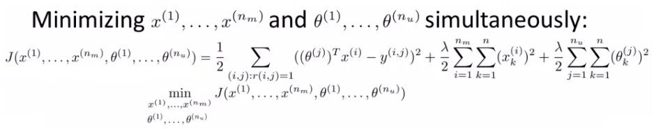

# Recommender Systems

## Recommender systems - introduction

* 추천 시스템을 설명하게된 두가지 동기
    1. ML 시스템의 주요한 응용분야
        + 많은 기업들이 추천 시스템을 중요하게 여긴다
        + Amazon, Ebay, iTunes 등의 웹사이트를 생각해보면 된다
            + 아마존의 경우 기존에 만족해한 구매 내역을 토대로 새로운 물건을 추천해주고 이는 아마존의 판매전략중 하나이다
        + 추천 시스템을 개선하는 것으로 더 많은 수익을 얻을 수 있다
        + 몇몇가지 재미있는 문제가 있다
            + 학술적인 분야에서는 인기있는 분야가 아니지만, 산업적인 분야에서는 매우 중요한 도구이다
    2. 기계학습의 큰 아이디어에 대한 이야기
        + 기술에 대한 것이 아니라 아이디어에 대한 것이다
        + Features가 매우 중요하다
            + ML에는 좋은 feature set이 무엇인지 학습하는 것에 대한 아이디어가 있다
            + 이런 featurs를 선택하는 것이 아니라 학습해서 알아내야 한다
        + 추천 시스템은 다음과 같은 일을 한다
            + 어떤 것이 중요하고 어떤 것이 관련되어있는지 식별한다

### Example - predict movie ratings

* 영화 판매 회사라고 가정하자
    - 고객이 영화 평점을 1-5점까지 매긴다
        + 0-5까지로 설정하면 수학적으로 더 쉬워진다
* 5개의 영화와 4명의 고객이 있다  

* 표기법
    - $n_u$ : 고객의 수
    - $n_m$ : 영화의 수
    - $r(i,j)$ : j번 고객이 i번 영화에 평점을 내렸는지 여부(1인 경우 평점을 매김)
    - $y^{(i,j)}$ : j번 고객의 i번 영화에 대한 평점
        + $r(i,j)$ 가 1일 경우에만 정의함
* 위의 예제의 경우
    - $n_u$ = 4
    - $n_m$ = 5
    - 평점 요약
        + Alice와 Bob은 로멘스코미디에 높은 평점을 주었지만, 액션 영화에는 낮은 평점을 부여함
        + Carol과 Dave는 게임에 높은 평점을 주었지만, 로멘스코미디에는 낮은 평점을 부여함
    - 이는 data를 통해 얻을 수 있는 정보이다
    - 해결해야할 문제
        + $r(i,j)$ 와 $y^{(i,j)}$ 를 통해 ?를 예측해야한다
        + 비어있는 값을 채워넣을 알고리즘을 생각해야한다

---

## Content based recommendation

* 위의 예제에서 어떻게 예측할 것인가
    - 각각의 영화에 포함된 장르의 비율을 측정할 수 있다
        + 로맨스 $(x_1)$
        + 액션 $(x_2)$  

* 각각의 영화를 feature vector를 사용하여 추천을 할 수 있다
    - 각 영화에 $x_0 = 1$ 을 추가한다
    - 각각의 영화는 $[3 \times 1]$ matrix를 갖게되고, "Love at last"는 다음과 같은 feature vector를 가진다
        + $x^{(1)} = \begin{bmatrix} 1 \\ 0.9 \\ 0 \end{bmatrix}$
    - $x_0$ 는 무시하기 때문에 n=2인 상태이다
* 각각의 평점에 대해서 각각의 사용자마다 linear regression으로 해결할 수 있다
    - 각각의 고객 j마다 pearmeter vector를 학습시킨다
    - 그리고 j가 i에 대해 어떻게 평가할지 예측한다
        + $(\theta^j)^Tx^i$ : 평점
        - parameter vector와 featur를 내적한다
    - User 1(Alice)가 Cute Puppies of Love(CPOL)을 어떻게 평가할지 예측해보자
        + Alice와 관련된 parameter vector $(\theta^1)$ 이 있다
            + 이를 도출하는 방법은 뒤에 설명할 것이다
            + $\theta^{(1)} = \begin{bmatrix} 0 \\ 5 \\ 0 \end{bmatrix}$
        + CPOL에 대한 parameter vector $(x^3)$ 는 다음과 같다
            + $x^{(3)} = \begin{bmatrix} 1 \\ 0.99 \\ 0 \end{bmatrix}$
        + 이를 내적하면 다음과 같은 점수를 얻을 수 있다
            + $(\theta^1)^Tx^3 = (0 \times 1) + (5 \times 0.99) + (0 \times 0)$
            + = 4.95 
    - 고객의 로맨스와 액션에 대한 선호도를 기반으로 다른 영화들에 대한 별점을 예측한다
    - 이를 위해 하나의 추가적인 변수가 필요하다
        + $m^j$ : 고객 j가 평점을 매긴 영화의 수

### How do we learn $(\theta^j)$

* 이 과정은 least-squared error과 동일하기 때문에 다음과 같은 식을 사용하게 된다  

* Regularization term의 경우 k=1 to m 까지이다
    - k=0은 regularize하지 않는다
* 이를 모든 고객에 대해서 학습해야하기 때문에 다음과 같은 식이 완성된다  

* 이 식을 통해 $J(\theta^1, \theta^2, \dots, \theta^{n_u})$ 를 구할 수 있다
* 이를 최소화 하기 위해서 graident descent를 사용면 된다  

* 이전의 gradient descent와의 차이점
    - $k = 0$ 일때와 $k \neq 1$ 일 때로 나눠진다
    - $\frac{1}{m}$ 항이 존재하지 않는다
    - 이 외에는 매우 유사하다
* 위의 과정을 content-based approach라고 한다
    - 콘텐츠와 관련해서 고객이 흥미를 느낄 만한 것을 추측하기 때문이다
    - 이 feature를 사용할 수 없을 수도 있다

---

## Collaborative filtering - over view

* Collaborative filtering 알고리즘은 feature를 학습한다는 특징이 있다
    - 이는 어떤 feature가 필요한지 스스로 학습할 수 있다는 뜻이다
* 이전의 5개의 영화와 4명의 고객에 대한 예시
    - 이 예시에서 각각의 영화가 포함한 로맨스와 액션의 비율은 이미 계산되어있었다
        + 실제로는 이것을 측정하는 것은 매우 어렵다
        + 종종 그 이상의 분류가 더 필요할 수 있다
* 이번 예제에서는 어떤 영화가 어떤 장르가 얼마나 포함되어있는지 모를 경우이다  
    
    - 다른 방식의 추정이 필요하다
        + 각각의 고객이 어떤 영화를 얼마나 좋아하는지 조사했다
            + Romantic films
            + Action films
        + 이를 통해 다음과 같은 parameter set을 만들 수 있다  
            
        + Alice와 Bob은 로멘스를 좋아하지만 액션은 싫어한다
        + Carol과 Dave는 액션을 좋아하지만 로맨스를 싫어한다
* 고객으로부터 이 정보를 얻을 수 있다면 각각의 영화에 각 고객이 어떤 평가를 할지 추측할 수 있다
    - "Love at Last"를 보자
        + Alice와 Bob은 이 영화를 좋아한다
        + Carol과 Dave는 이 영화를 싫어한다
    - Feature vector를 통해 Alice와 Bob은 로맨틱 영화를 좋아하고 Carol과 Dave는 싫어한다는 것을 알고있다
        + Alice와 Bob은 "Love at Last"를 좋아하고 Carol과 Dave는 싫어한다는 것을 통해 이 영화가 로멘스 영화라는 것을 알 수 있다
* 수학적인 측면에서는 조금 생략된 면이 있지만 중요한 점은 $x^1$ 이 어떤 값을 가질지이다
    - Parameter set과 $x^1$ 을 내적한 결과는 다음과 같다
        + $(\theta^1)^Tx^1 = 5$
        + $(\theta^2)^Tx^1 = 5$
        + $(\theta^3)^Tx^1 = 0$
        + $(\theta^4)^Tx^1 = 0$
    - 이를 통해 $x^1$ 이 다음과 같다고 추측할 수 있다
        + $x^{(1)} = \begin{bmatrix} 1 \\ 1.0 \\ 0.0 \end{bmatrix}$
    - 동일한 방법으로 다른 영화들의 featur vector를 계산할 수 있다

### Formalizing the collaborative filtering problem

* 위의 과정을 수식으로 표현하면 다음과 같이 표현할 수 있다
    - $\theta^1, \theta^2, \dots, \theta^{n_u}$ 가 주어진다
        + 각 고객들의 장르 선호도
    - 영화와 관련된 최적의 parameter vector를 찾을 수 있는 최적화 함수를 최소화해야한다  
        
        + 모든 영화 i와 평점을 매긴 모든 j에 대해 합을 구한다
        + 이 error를 최소화 해야한다
    - 이전과 같이 위의 식은 하나의 영화에 대한 feature를 학습하게 된다
        + 모든 영화에 대한 모든 feature vector를 얻기 위해서는 $\sum$ 이 필요하다

### How does this work with the previous recommendation system

* 기존의 추천 시스템을 생각해보자
    - 영화에 어떤 장르가 얼마나 포함되어있는지 알면 고객이 그 영화를 얼마나 좋아할지에 대한 정보를 에측할 수 있었다
* Collaborative filtering의 경우 고객의 선호도와 영화에 대한 평가를 알면 해당 영화가 어떤 장르가 얼마나 포함되어있는지 알 수 있다
* 닭이 먼저인지 달걀이 먼저인지에 대한 문제와도 비슷하다
* 이를위해서 다음의 작업을 할 수 있다
    - $\theta$ 를 완전히 무작위로 추측한다
    - Collaborative filtering을 활용해서 x를 만든다
    - Content0-based recommendation을 사용해서 $\theta$ 를 변경한다
    - 이를 사용해서 x를 만든다
    - 를 반복한다
* 고객이 알고리즘이 features를 학습하는 것과 시스템을 도와주기 때문에 Collaborative filtering이라고 부른다

---

## Collaborative filtering Algorithm

* 두 알고리즘을 결합한다
    - 영화의 features를 알고있다면 이를 통해 고객의 선호도를 계산한다  
        
    - 고객의 선호도를 알고있다면 이를 통해 영화의 features를 계산한다  
        
* 이를 활용하기 위해서 parameter를 무작위로 초기화하고 두 식을 반복하여 계산한다
* x와 $\theta$ 를 동시에 계산할 수 있는 더 효율적인 알고리즘이 있다
    - x와 $\theta$ 에 대한 최적화 함수를 정의한다  

* 위의 식에 대해 이해하기
    - 위의 두 식의 전체의 squared error를 구하는 식이다  
        
        + 모든 고객이 매긴 모든 영화에 대한 별점의 합
        + ":"의 의미는 "for which"이다
            + r(i,j)=1인 모든 i와 j
    - Regularization terms
        + 두 최적화 함수의 뒤에 추가해준다
* 새로 정의된 함수의 성질은 다음과 같다
    - x를 고정시켜놓고 $\theta$ 값 만을 변화시키면 위의 x가 주어졌을 때 $\theta$ 를 구하는 문제가 된다
    - 비슷하게 $\theta$ 를 고정시키면 x를 구하는 문제가 된다
* 이 함수는 film features x와 user parameter $\theta$ 둘 모두에 대한 함수가 된다
* 이런 방식으로 features를 학습하면 다음과 같은 이점이 생긴다
    - $x_0 = 1$ 을 추가했다
    - 이 방식을 사용하면 $x_0$ 가 존재하지 않는다
        + 때문에 x와 $\theta$ 모두 n차원 백터가 된다

### Algorithm Structure

1. $\theta^1, \dots ,\theta^{n_u}$ 와 $x^1, \dots, x^{n_m}$ 을 각각 무작위 작은 수로 초기화 한다
    - Newural network를 계산하는 것 처럼 비슷하게 하면 된다
2. Gradient descent를 사용하여 $J(\theta^1, \dots ,\theta^{n_u}, x^1, \dots, x^{n_m})$ 를 최소화한다  
    
    - 위의 항은 cost function을 $x_k^i$ 에 대해 편미분한 결과이고, 아래 항은 $\theta_k^i$ 에 대해 편미분한 결과이다
    - 이 식으로 모든 parameters를 정규화 하기 때문에 특별하게 식을 변경할 필요가 없다
3. 이를 최소화 하면 user j에 대한 parameter $\theta$ 와 영화 i에 대한 feature x를 구할 수 있고, 이를통해 $(\theta^j)^Tx^i$ 를 통해 고객의 별점을 예측할 수 있다
    - 이것이 colaborative filtering algoritm이고, 이는 고객이 새로운 영화를 좋아하는지를 예측할 수 있는 좋은 방법이다

---

## Vectorization: Low rank matrix factorization

* Collaborative filtering 알고리즘의 개선방안
    - 제품 하나가 주어졌을 때 다른 것과의 연관성을 결정할 수 있는가
* 다른 예측하는 방법을 찾아야한다
    - 각각의 고객이 평가한 영화의 평점에 대한 집합을 matrix Y로 표현한다  
        
        + 5개의 영화
        + 4명의 고객
        + 이를통해 $[5 \times 4]$ Matrix를 얻을 수 있따
    - Y를 평점 예측으로 나타내면 다음과 같이 나타낼 수 있다  
        
* 또 다른 matrix X를 정의할 수 있다
    - Linear regression에서 정의한 것 처럼 각각의 영화의 feature를 row vector로 쌓아서 만들 수 있다  
    $x = \begin{bmatrix}-(x^{(1)})^T-\\ -(x^{(2)})^T-\\ \vdots \\ -(x^{(n_m)})^T-\\ \end{bmatrix}$
* 마찬가지로 $\Theta$ matrix도 정의할 수 있다  
    $x = \begin{bmatrix}-(\Theta^{(1)})^T-\\ -(\Theta^{(2)})^T-\\ \vdots \\ -(\Theta^{(n_u)})^T-\\ \end{bmatrix}$
* X와 $\Theta$ matrix로 $X \cdot \Theta^T$ 를 계산하여 ㅇ"ㅖ측이 가능하다
* 이 알고리즘을 low rank matrix factorization이라고 부른다
    - X matrix와 $\Theta$ matrix를 low rank matrix라고 부른다

### Recommending new movies to a user
* Collaborative filtering algorithm을 통해 관련있는 영화를 찾을 feature를 학습할 수 있다
    - Features set을 학습할 때 어떻게 될지 알 수 없다
        + 해당 feature가 어떤 영화를 정의하는지는 식별할 수 있다
    - Features의 예시
        + $x_1$ : 로맨스
        + $x_2$ : 액션
        + $x_3$ : 코미디
        + $x_4$ : $\dots$
    - Features를 학습한 이후 해당 feature가 어떤 기준으로 생성되었는지 알기 어려울 수도 있다
        + 대부분의 경우 학습 결과는 고객이 어떤것을 좋아하는지 파악하는 것에 유용하다
* 영화 i가 있을 때
    - 이와 비슷한 j를 찾으면 이를 추천할 수 있다
    - Features는 영화의 유사성을 측정하기 매우 좋은 방법이다
    - $x^i$ 와 $x^j$ 가 있을 때
        + $||x^i - x^j||$ 가 최소화되는 j를 찾으면 고객이 가장 재미있게 본 영화와 가장 유사한 것을 추천할 수 있다

---

## Implementation detail: Mean Normalization

* 알고리즘이 잘 동작하기 위한 한가지 방법이 있다
* Mean normalization을 잘 보여주기 위해서 어떤 영화에도 별점이 없는 고객을 가정한다  
    
    - 알고리즘이 이 고객을 나타내기 위한 방법
        + n=2
        + $\theta^5$ 를 학습한다
    - 하지만 $r(i,j)=1$ 을 만족하는 i가 존재하지 않는다
        + 위의 중 앞의 항은 식은 $\theta^5$ 를 정의할 수 있는 방법이 없다
        + 때문에 정규화 항을 이용한다
* 이를 최소화하면 다음과 같은 결과가 나온다
    - $\theta^5 = \begin{bmatrix}0 \\0 \end{bmatrix}$
    - 아무런 data가 없기 때문에 0이 될 때가 최소가 된다
* 이는 모든 영화를 0으로만 예측할 수 있다는 의미이다
    - Eve가 모든 영화를 싫어하지는 않겠지만, 어떤 영화도 추천해줄 수 없다
* Mean normalization은 이를 해결할 수 있다

### How dose Mean normalization work
* 모든 평가가 담긴 mnatrix Y가 있었다
    - Y에 Eve의 평가에 해당하는 ?로 이루어진 column이 있다  
    
    - 각 영화의 평가의 평균에 해당하는 평균을 각각 가진 $n_m$ 차원의 column vector를 만든다  
    
    - Y matrix의 각 column vector에서 $\mu$ vector를 빼준다  
    
    - 0은 각 영화의 평균 평점을 의미하게 된다
* 고객 j의 영화 i에 대한 평점을 예측할때 다음과 같은 식을 사용하게 된다
    - $(\theta^j)^Tx^i + \mu_i$
    - 이를 이용하면 정보가 아무것도 없는 고객에게 평균적인 영화의 평점으로 추천할 수 있다