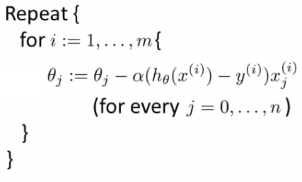
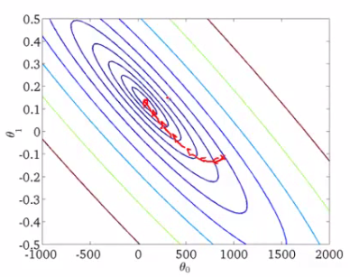
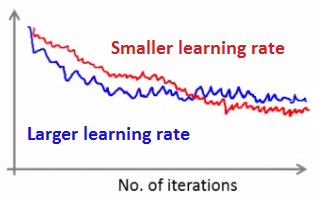
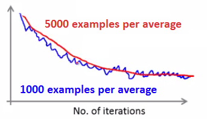
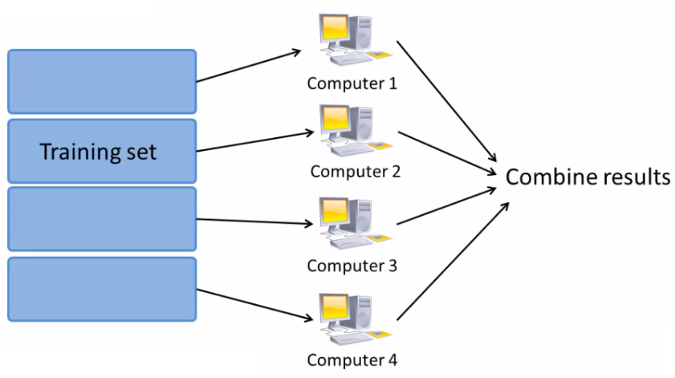

## Learning with large datasets

* 5-10년 간의 LM의 발전을 살펴보면 data가 매우 많아지며 큰 발전을 이루게 되었다
    - 이때문에 계산에 더 많은 cost가 소모된다
    - 알고리즘이나 Architecture 수준에서 해결할 다양한 문제들이 생겨났다

### Why large dataset
* 성능을 높이는 가장 좋은 방법중 하나는 low bias 알고리즘을 만들고 많은 data로 훈련하는 것이다
    - 알고리즘에 제공하는 data가 많아지면 성능이 비슷해진다
    - 이런 이유들로 인해 큰 dataset을 사용하는 것이 학습에 좋다
* 하지만 data가 많아지면 computational problems가 발생한다

### Learning with large datasets

* m = 100,000,000인 dataset이 있다고 가정하자
    - 이는 현실적으로 있을 수 있는 수치이다
        + 인구조사 data
        + Website traffic data
    - 이정도의 큰 규모에 어떻게 logistic regression을 훈련할 수 있는가
        + Gradient descent의 각 step마다 100,000,000번의 합 연산을 해야한다
* 대규모의 합산 연산 cost를 해결하기위한 효율적인 방법이 필요하다
    - 다른 접근 방식을 사용하거나 합산 연산을 하지 않고 최적화 한다
* 해결 방법중 하나는 100,000,000 대신 1,000개의 dataset으로 훈련이 가능한지 확인한다
    - 적은 수를 무작위로 선택한다
        + 몇몇 경우에는 성능이 좋은 시스템을 만들어낼 수 있고, 이 경우 big data 때문에 발생하는 문제를 해결할 수 있다
* 적은 수의 sample로 수행했을 때의 training set size에 대한 error의 그래프를 그려보면 적은 수에서 잘 동작되는지 알 수 있다
    - 그래프가 다음과 같다면  
    
    - 위의 경우 high variance이다
        + 더 많은 examples가 있으면 성능이 향상된다
    - 그래프가 다음과 같다면  
    
    - 위의 경우 high bias이다
        + 이 경우 더 많은 examples가 도움되지 않는다
            + 이를 미리 알 수 있다면 계산하는 시간과 노력을 아낄 수 있다
        + 이 경우에는 features를 추가하거나 neural networks를 사용한 경우에는 hidden units을 추가하는 것이 해결 방법이다

---

## Stochastic Gradient Descent

* 대부분의 학습 알고리즘은 최적화를 위해 cost function을 최소화하는 알고리즘을 사용한다
    - 큰 dataset을 사용할 경우 gradient descent는 매우 큰 비용이 소모된다
    - 큰 data sets을 최적화 하기 위한 다른 방법을 정의할 필요가 있다

### Stochastic gradient descent
* 다음처럼 약간 다른 cost function이 정의된다  
    
    - 이 함수는 특정한 example $(x^i, y^i)$ 의 $\theta$ 의 cost를 나타낸다
        + 이 squared error에 $\displaystyle \frac{1}{2}$ 를 곱한 값으로 계산한다
    - 단일 예제에서 hypothesis가 잘 작동하는지 측정한다
* 다음과 같은 형태로 cost function을 재정의 한다  
    
    - 이는 batch gradient descent의 cost function과 동일하다
* Linear regression과의 약간의 차이점에 대한 관점에서 stochastic gradient descent가 어떻게 작동하는지 확인할 수 있다

1. Randomly shuffle  

2. Algorithm body  

* 어떻게 동작되는가  
    
    - 위의 식은 batch gradient descent에서 cost function의 도함수와 동일한 형태이다
* Stochastic gradient descent algorithm은 각각의 example을 스캔 하며 동작한다
    - Inner for loop은 다음과 같은 역할을 한다
        + 1번째 training example만을 가지고 cost를 계산한다
        + 2번째 training example을 통해 fitting한다
        + 모든 data에 대해서 각각 작업을 시행한다
    - 이를 반복해서 수행한다
* Randomly shuffling을 한다는 것은 각 데이터의 정렬 순서에 얽매이지 않고 작업을 수행하여 치우치지 않게 수행한다는 의미이다
    - 무작위성을 갖게되면 수렴하는 속도가 아주 조금 빨라진다
* Stochastic gradient descent는 모든 example을 통해 갱신하는 것이 아니라 하나의 example만을 통해 갱신한다는 것을 제외하면 batch gradient descent와 매우 유사하다
    - Loop이 끝날 때 parameter를 갱신하는 것이 아니라 각 단계마다 parameter를 갱신한다는 의미이다
* 알고리즘의 동작에 따른 parameter의 변화
    - Batch gradient descent는 다음과 같은 형태로 global minmum을 찾는다  
        
    - 반면 stochastic gradient descent는 각각의 단계에서는 더 빠르지만 한개의 example만을 사용한다  
        
        + 위의 그래프를 보면 global minimum으로 가는 경향이 있지만 모든 경우에 그렇지는 않다
        + Batch gradient descent처럼 global minimum으로 수렴하는 것은 아니지만 global minimum 근방으로 값이 변화한다
            + Global minimum 근방인 것 만으로도 크게 문제 되지는 않는다

---

## Mini Batch Gradient Descent

* Mini match gradient descent는 stochastic gradient descent보다 더 빠른 방법이다
* 지금까지의 gradient descent를 정리하자면
    - Batch gradient descent: 각 단계마다 m개의 examples 모두 사용
    - Stochastic gradient descent: 각 단계마다 1개의 example 사용
    - Mini-batch gradient descent: 각 단계마다 b개의 examples 사용
        + b: mini-batch size
* 보통 b는 2에서 100 사이의 값을 사용한다
* 예를들면
    - b = 10
    - Training set에서 10개의 examples를 선택한다
    - 10개의 examples를 사용하여 gradient descent처럼 갱신한다

### Mini-batch algorithm  

* Batch gradient descent보다 더 효율적이다
    - b개의 examples만을 사용해서 parameter를 갱신한다
    - 모든 examples마다 갱신할 필요도 없고, 모든 examples를 확인하기 위해 기다릴 필요도 없다

### Mini-batch gradient descent vs. stochastic gradient descent

* 왜 mini-batch를 사용하는가
    - 백터를 사용한 구현이 가능하다
    - 더 효율적으로 구현이 가능하다
    - 병렬 연산이 가능하다(b개의 작업을 한번에 할 수 있다)
* Mini-batch gradient descent의 단점은 b의 최적 값을 찾는 것이다
* Mini-batch gradient descent와 stochastic gradient descent는 batch gradient descent의 특별한 형태중 하나이다

---

## Stochastic gradient descent convergence

* Stochastic gradient descent에 대해 더 알아야 하는 것
    - 언제 종료되는가
    - Learning rate alpha $(\alpha)$ 값을 어떻게 조절하는가

### Checking for convergence

* Batch gradient descent를 사용할 때의 반복 횟수에 따른 cost function의 값을 그래프로 표현할 수 있다
    - 반복할 때 마다 감소할 것이다
    - 모든 examples에 대해 합산을 해야하기 때문에 training set의 크기가 작을 때만 작동한다
        + 매우 큰 dataset에서는 동작하지 않는다
    - Stochastic gradient descent
        + 모든 examples에 대해 합산 연산을 하지 않기 대문에 중간에 연산이 중지되지 않는다
        + 전체 합산을 피하는 것이 stochastic gradient descent의 핵심이다
* Stochastic gradient descent에서는 뭔가를 변경할 필요가 있다
    - Cost function을 정의한다  
        
        + 단일 examples의 wquared error의 절반이다
    - 알고리즘이 각각의 example을 확인할 때 $\theta$ 의 update 전의 값을 확인할 수 있다
* 수렴 여부를 확인하기 위해 1,000회의 반복마다 1,000동안의 cost의 평균치를 그래프로 나타낼 수 있다
* 아래의 그래프들이 의미하는 바
    - 1,000개는 그리 많은 수가 아니기 때문에 노이즈가 발생할 수 있다
    - 아래와 같은 수치를 얻는다면  
        
        + 잘 작동하는 것처럼 보이기 때문에 아마 수렴할 것이다
    - 더 작은 learning rate를 사용하면 더 나은 결과를 도출할 수 있을 것이다  
        
        + Parameter가 global minimum을 중심으로 진동하기 때문에 이런 그래프가 나오게 된다
        + 더 작은 learning rate는 더 작은 진동을 만들어낸다
    - 1,000개의 평균이 아닌 5,000개의 평균을 사용한다면 더 부드러운 곡선을 만들 수 있을 것이다  
        
        + 평균을 계산할 수를 늘리게 된다면 결과값을 더 적게 얻게 된다
    - 종종 그래프가 아래와 같은 형태를 가질 수도 있다  
        
        + 1,000개의 평균으로는 증가하는지 감소하는지 알기 힘들지만, 더 많은 수의 평균을 사용한다면 전체적인 추세를 확인할 수 있다
            + 이는 파란 그래프는 너무 노이즈가 많고, examples의 수를 더 많게 설정해서 노이즈를 없앤 것이다
        + 이렇게 examples의 수를 늘려도 감소하지 않을 수도 있다
    - 아래와 같이 증가하는 형태의 그래프는 알고리즘이 발산한다는 것을 의미한다  
        
        + 이경우에는 더 작은 learning rate를 사용해야한다

### Learning rate 

* Stochastic gradient descent는 global minimum 주변에서 진동한다
    - 대부분의 경우 learning rate는 고정되어있다
* Minimum으로 수렴하기 위해서는 learning rate가 점차 감소해야한다
    - 고전적인 방법으로 $\alpha$ 를 계산하는 것은 다음과 같다
    - $\alpha$ = const1/(iterationNumber + const2)
    - 이렇게 하면 한 점으로 수렴하게 된다
        + const1과 const2를 잘 정해야한다
    - 이를 잘 조절하면 다음과 같은 그래프를 얻을 수 있다  
    

---

## Online learning

* New setting
    - 연속된 data stream을 학습할 알고리즘
    - Stochastic gradient descent와 비슷한 아이디어이지만 갱신이 조금 느리다
    - 인터넷 회사는 트래픽을 통해 학습할 수 있는 다양한 online learning 알고리즘을 사용한다
        + 예를 들면 고객이 어떻게 사용하는지를 학습해서 더 나은 최적화 된 사이트를 제공할 수 있기 때문이다
* Example - Shipping service
    - 고객이 출발지와 도착지를 알려준다
    - 배송 비용을 제시한다(10-50\$)
    - 제시된 비용을 토대로 고객이 서비스를 이용하면 y=1, 아니라면 y=0 으로 설정한다
    - 제시된 비용에 따른 고객의 반응에 대한 알고리즘을 만든다
        + Capture
            + 고객에 대한 정보
            + 출발지와 도착지
        + Work out
            + 고객이 서비스를 이용할 확률
    - 이를 아래와 같이 표현할 수 있다
        + $p(y=1|x;\theta)$
            + $\theta$ 를 통해 x가 주어졌을 때 y=1일 확률
        + Logistic regerssion이나 Neural network 등으로 모델을 만든다
    - 지속적으로 동작하는 웹사이트가 있다면, online learning 알고리즘이 다음과 같은 일을 할 것이다
        + User comes : 다음과 같은 (x, y) 쌍
            + x: feature vector
                - 가격, 출발지, 도착지 같은 정보가 포함 됨
            + y: 고객이 서비스를 이용했는지 여부
        + 새로운 정보가 들어오면 이를통해 $\theta$ 를 갱신한다
    - 입력 stream이 있기 때문에 set의 개념이 아닌 지속적으로 발생하는 data를 통해 $\theta$ 를 갱신하기 때문에 indexing을 할 필요가 없다
* 대규모의 입력 stream을 제공할 수 있는 메이저한 웹사이트가 있다면 이런 알고리즘이 꽤 의미있을 것이다
    - 모든 training data를 학습할 필요는 없다
* 만약 이용 고객의 수가 적다면 data를 저장한 뒤 일반적인 알고리즘을 사용하여 학습하면 된다
* Online algorithm은 변화하는 고객의 선호도를 반영할 수 있다
    - 고객이 가격에 대해 더 민감하게 변화하더라도 알고리즘이 이에 적응하고 학습할 수 있다
        + 이 알고리즘은 동적이다

### Another example - product search

* 핸드폰을 판매하는 온라인 판매점을 운영한다
    - "Android phone 1080p camera" 같은 검색이 가능한 UI가 있다
    - 고객에게 1번의 검색에 10개의 핸드폰에 대한 정보를 제공한다
* How do we do this
    - 고객의 검색 요청이 들어오면 그에 대해 각각의 핸드폰에 대한 feature vector를 생성한다
        + feature vector에는 핸드폰의 기능과 같은 데이터, 고객의 검색어와 핸드폰의 이름중 일치하는 단어의 수, 고객의 검색어와 핸드폰의 기능중 일치하는 단어의 수 등과 같은 데이터가 포함된다
            + 검색어와 핸드폰이 얼마나 잘 매칭되는지에 대한 정보이다
    - 고객이 핸드폰을 선택할 가능성을 예측하고 싶다
    - 고객이 링크를 클릭하면 y=1, 아니라면 y=0으로 정의한다
    - 우리가 학습하기 원하는 것은 $p(y=1|x;\theta)$ 이다
        + Click through rate(CTR)을 통해 학습하는 문제이다
    - 어떤 핸드폰에 대한 CTR을 예측할 수 있다면, 이를 통해 가장 확률이 높은 핸드폰 순서대로 제공할 수있다
    - 검색어당 10개의 핸드폰의 정보를 제공해야 한다면 각 검색에 대해 10개의 training exampes를 만들어야 한다
        + 고객이 얼마나 클릭을 하는지 여부에 따라 알고리즘이 잘 동작하는지를 판단할 수 있다
* Other things you can do
    - 고객에게 보여줄 특별 정보
    - 사용자가 좋아할 만한 뉴스 기사
    - 제품 추천
* 다른 방법을 사용해도 되지만 이 방법은 많은 data를 잘 이용할 수 있는 더 괜찮은 방법이다

---

## Map reduce and data parallelism

* 이전에 stochastic gradient descent나 다른 알고리즘에 대해 배웠다
    - 이들은 하나의 컴퓨터로 연산이 가능했다
    - 하지만 몇몇 경우에는 하나의 컴퓨터로 연산하기에는 너무 계산량이 많을 수 있다
    - 이때문에 Map Reduce를 사용한다
* Map reduce example
    - Batch gradient descent를 연산해야한다  
        
        + m=400이다
            + 일반적으로 m은 400,000,000일 것이다
            + m이 이정도로 크다면 연산이 너무 오래 걸릴 것이다
    - Training set을 부분집합으로 나눈다
        + 4개로 나눈다고 해보자
    - 1번 컴퓨터는 $(x^1,y^1), \dots, (x^{100}, y^{100})$ 을 활용한다
        + Training set을 4등분 한 것중 첫번째
        + 첫 100개에 대해서만 합산한다
    - 2-4번 컴퓨터 각각 아래와 같이 연산한다  
        
    - 각 기계는 1/4만큼의 작업을 수행하고, 이에대한 4개의 temp 값을 얻을 수 있다
    - 일단 temp 변수가 생기면 이를 중앙의 master server로 전송하고 이를 다시 함쳐서 $\theta$ 를 갱신하기위해 사용한다
        + $\displaystyle \theta_j := \theta_j - \alpha \frac{1}{400}(temp_j^{(1)} + temp_j^{(2)} + temp_j^{(3)} + temp_j^{(4)})$
        + 위의 식은 원래의 batch gradient descent와 동일한 역할을 한다
* Map reduce는 다음과 같이 표현된다(4개로 분할한 경우)  
    
* Gradient descent의 대부분의 작업은 합산연산이다
    - 이제 각각의 컴퓨터가 1/4의 작업만 하기 때문에 4배 빨라진다
        + 실질적으로 다른 연산과 네트워크를 사용하기때문에 발생하는 지연시간을 합치면 4배보다 덜 빠르지만 훨씬 빨라지게 된다
* Training set의 function을 합하는 것 만으로도 알고리즘이 동작하는가
    - 많은 경우 그렇다