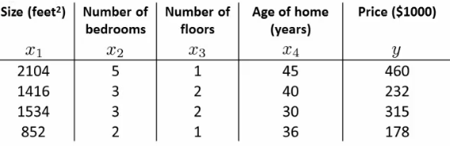

# 04: Linear Regression with Multiple Variables

## Linear regression with multiple features
* multiple features = multiple variables
* 이전의 함수는 아래와 같았다
    - X = house size(이걸로 가격을 예측함)
    - y = house price
* 만약 더 많은 변수가 필요하다면
    - $x_1, x_2, x_3, x_4$ 같이 4개의 변수가 있다고 하자
        + $x_1$ : 크기
        + $x_2$ : 방의 수
        + $x_3$ : 층수
        + $x_4$ : 연식
    - y : output variable(가격)
* 추가적인 정보
    - n : # of features (n=4)
    - m : # of examples
    - $x^i$ : 
        + i번째 input의 vector
        + i번 index의 training set
        + 예제
            + $x^i$ 는 n차원(4차원) vector이다
            + $x^3$ 은 3번째 집에대한 정보이다.
    - $x_j^i$ : 
        + i번째 training data의 j번째 변수
        + 예제
            + $x_2^3$ : 3번째 집의 방의 수
* Multiple features
    - 이전까지의 cost function
        + $h_\theta(x) = \theta_0+\theta_1x$
            + 1개의 변수와 2개의 parameter가 존재한다.
        + $h_\theta(x) = \theta_0 + \theta_1x_1 + \theta_2x_2 + \theta_3x_3 + \theta_4x_4$
            + 위와 같이 여러개의 변수에 대한 식을 만들 수 있다
        + 예시
            + $h_\theta(x) = 80 + 0.1x_1 + 0.01x_2 + 3x_3 + 2x_4$
    - 위의 식 간략히 표시하기 위해 $x_0$ = 1로 변경했다
        + 모든 i 예제에서 0번 feature가 추가되어있다
        + n+1차원의 feature vector의 0번 index가 이에 해당한다
            + 이 vector를 x라고 표기한다
        + Parameters도 0번 index가 추가된 n+1차원의 vector이다
            + 이 vector를 $\theta$라고 표현한다
        + 위의 식을 아래와 같이 다시 쓸 수 있다
            + $h_\theta(x) = \theta_0x_0 + \theta_1x_1 + \theta_2x_2 + \theta_3x_3 + \theta_4x_4$
* 이를 아래와 같이 표현할 수 있다
    - $h_\theta(x) = \theta^TX$
        + $\theta^T$ 는 $[1 \times n+1]$ 차원의 Matrix이다
        + $\theta$ 는 column vector고, $\theta^T$는 row vector이다.
        + $\theta^T \times X$
            + $[1 \times n+1] \times [n+1 \times 1]$
            + = $h_{\theta}(x)$
            + 이므로 parameter vector와 example X의 곱연산 결과는 $[1 \times 1]$ 의 차원을 갖는다

---

## Gradient descent for multiple variables
* Fitting parameters for the hypothesis with gradient descent 
    - $\theta_0$ 부터 $\theta_n$ 까지의 parameters가 있다.
    - 이 parameters를 n개의 개별 값이 아니라 1개의 단일 vector라고 생각하자
        + $\theta$ 는 n+1차원 Vector이다
* Cost Function은 아래와 같다
$
\\
\displaystyle
J(\theta_0,\, \theta_1,\, \dots \,,\, \theta_n) = \frac{1}{2m}\sum_{i=1}^m(h_\theta(x^{(i)})-h^{(i)})^2
$
* 마찬가지로 J함수도 n+1개의 개별의 함수가 아니라 1개의 단일 parameter vector의 함수라고 생각하자
    - $J(\theta)$
$
\\
\displaystyle
Repeat\{ \\
\theta_j:=\,\theta_j - \alpha\frac{\partial}{\partial\theta_0}J(\theta_0,\, \theta_1,\, \dots \,,\, \theta_n)
\\ \}
$
        - $\theta_j$ = $\theta_j$ - learning rate($\alpha$) $\times$ $J(\theta)$ 를 $\theta_j$ 에 대하여 편미분 한 결과
        - 모든 $\theta_j$ 의 값을 동시에 update한다
### n = 1일 때
$
\\
\displaystyle
\begin{aligned}
Repeat\{
\\
\theta_{0} := \theta_{0} - \alpha &\frac{1}{m}\sum_{i=1}^m(h_\theta(x^{(i)})-y^{(i)})
\\
(\; =& \frac{\partial}{\partial\theta_0}J(\theta)\;)
\\
\theta_{1} := \theta_{1} - \alpha &\frac{1}{m}\sum_{i=1}^m(h_\theta(x^{(i)})-y^{(i)}) \cdot x^{(i)}
\\\}
\end{aligned}
$
* 위의 식에서 $\theta_{0}$ 와 $\theta_{1}$ 의 update 식에 차이가 있어보인다
    - 하지만 위의 두 식은 같다
        + $x_0^{(i)}$ 가 1이기 때문에 없는 것 처럼 보이는 것이다
    - 이를 multivariate gradient descent에 적용할 수 있다

### n $\geq$ 1일 때

$
\displaystyle
\theta_{j} := \theta_{j} - \alpha \frac{1}{m}\sum_{i=1}^m(h_\theta(x^{(i)})-y^{(i)}) \cdot x_j^{(i)}
$
* n = 1일 때와 마찬가지로 0부터 n까지 동시에 update한다
    - $\theta_j$ 에서 $\theta$ vector를 편미분 한 값에 learning rate($\alpha$)를 곱한 값을 빼주는 것을 반복한다
    - 이를 상세히 보면
        + Learning rate
        + 1/m을 곱한 값
        +  $\sum$ 연산 결과를 곱한 값
$
\\
\displaystyle
\frac{1}{m}\sum_{i=1}^{m}(h_\theta(x^{(i)})-y^{(i)})\cdot x_j^{(i)} = \frac{\partial}{\partial \theta_j}J(\theta)
$

---

## Gradient Decent in practice
* Feature scaling
    - Multiple features problem에 대해서 각각의 features의 크기가 유사한지 확인해야한다
        + 그러면 gradient desent가 더욱 빠르게 수렴한다
    - 예시
        + x1 = 크기(0-2000 feet)
        + x2 = 방의 수(1-5)
        + 두 변수의 범위가 크게 차이나기 때문에 $\theta_1, \theta_2$ 를 표현하면 높고 얇은 형태가 나타난다
        
    - 이런 형태의 cost function을 gradient descent는 global minimum을 찾는데 시간이 오래걸릴 수 있다
* Pathological input to gradient descent
    - 이러한 입력을 rescale해야 더욱 효과적이다
    - 각 변수를 최대값으로 나눈 값으로 사용할 수 있다
    - 그래프가 원과 비슷해진다(0~1사이의 값을 가지기 때문)
* 각 변수의 범위를 -1 ~ 1의 범위로 만들 수 있다
    - 큰 범위, 작은 범위, 매우 다른 범위를 갖는 것을 피하려고 함
    - 허용가능 범위
        + 3 to +3 is generally fine - any bigger bad
        + -1/3 to +1/3 is ok - any smaller bad 
* 일반화
    - $x_i$ 에 대하여
        + $x_i$ 를 $(x_i - 평균) / max$ 로 바꾼다
        + 모든 $x_i$ 의 평균은 0과 근접할 것이다

$
\displaystyle
x_i := \frac{x_i - \mu_i}{S_1} \\
\mu_i : training set의 x_i의 평균값 \\
S_i : 표준편차
$

---

## Learning Rate $\alpha$ 
* Learning rate $\alpha$ 에 대하여
* 목차
    - Update rule
    - Debugging
    - $\alpha$ 를 선택하는 법

### Make sure gradient descent is working
* $min J(\theta)$ 에 대한 iterations 횟수 그래프
* Gradient descent가 정상적으로 동작한다면 $J(\theta)$ 는 매 반복마다 감소해야한다
* 특정 횟수 이후에는 큰 이득을 얻지 못할 수 있다
    - 반복 횟수를 줄이기 위해 Heuristic을 활용할 수 있
    - 1000번의 반복 후에 parameter의 변화량이 크지 않다면 1000번만 반복하도록 설정할 수 있다
    - 반복 횟수는 다양하다
        + 30회
        + 3000회
        + 등 몇 번이 필요한지 미리 알 수 없다.
    - Automatic convergence test
        + $J(\theta)$ 가 작은 threshold 이하로 변화되는지 확인한다
            + 이 threshold를 선택하는 것은 어렵다
            + 직선에서는 확인하기 쉬운 경우가 많다
                + 왜냐하면 전체적인 알고리즘의 흐름이 직선적이기 때문이다
                + 시작 전 시스템을 기반으로 automatic checker를 설계할 수 있다
    - 동작 확인
        + $j(\theta)$ 에 대한 반복횟수의 그래프와 값의 증가량을 확인하면 더 작은 $\alpha$ 가 필요할 수 있다
            + minimizing a function이 아래와 같은 형태로 나타날 수 있다
            
            + Overshoot 때문에 minimum(초록 선)으로 수렴하도록 learning rate를 줄여야 한다
            
* $J(\theta)$ 가 sin파 같은 형태일 수 있다는 다른 문제점이 있다
    - 이런 때에도 더 작은 $\alpha$ 가 필요할 것이다
* $\alpha$ 가 충분히 작다면
    - $J(\theta)$ 는 매 반복마다 감소할 것이다
    - 하지만 $\alpha$ 가 과하게 작다면 매우 오래 걸릴 것이다
* 일반화 하면
    - $\alpha$ 값의 범위 찾는 것을 시도한다
    - 각 $\alpha$ 에 대한 $J(\theta)$ 에 대한 반복횟수의 그래프
    - 3배로 증가시킨다
        + 0.001, 0.003, 0.01, 0.03. 0.1, 0.3

---

## Features and polynomial regression
* Feature의 선택과 이를 통한 여러 learning algorithm을 구현하는 방법
* Polynomial regression for non-linear function
* 예시
    - 집 가격 예측
        + 변수 2개
            + frontage : 도로와 인접한 
            + depth : 도로와의 거리
        + 이 변수 2개를 그대로 사용할 필요는 없다
            + 새로운 변수를 만들어낼 수 있다
        + 중요한 변수는 면적에 비례할 것이다
            + 새로운 변수($x_3$) = frontage($x_1$) $\times$ depth($x_2$) 로 정의할 수 있다
            + $h(x) = \theta_0 + \theta_1 x_3$
                + 면적으로 기준을 삼는 것이 더 좋다
    - 새로운 변수를 정의하는 것으로 더 나은 모델을 얻을 수도 있다
* Polynomial regression
    - data를 fitting할 때 더 나을 수 있다
    - $\theta_0 + \theta_1 x + \theta_2 x^2$
        + 이런 2차 함수 식을 만들 수 있다
    - house data는 2차 함수로 나타낼 수 있다
        + 하지만 데이터에 잘 맞지 않을 수 있다
            + 변곡점이 존재하기 때문에 집의 크기가 일정 이상 커지면 가격이 하락한다
        + 때문에 3차함수를 활용해야한다
* 어떻게 data에 잘 맞는 함수를 만들 수 있는가
    - 1차 함수와 cost function을 이런 polynomial description로 매핑할 수 있다
        + $x_1 = x$
        + $x_2 = x^2$
        + $x_3 = x^3$
    - 변수를 이렇게 바꾼다면 linear regression algorithm을 적용하면 polynomial linear regression을 해결할 수 있다
    - feature scaling이 중요하다
* 기존 polynomial의 변수 대신 $\sqrt{x}$ 혹은 $3\sqrt{x}$ 등으로 바꿀 수 있다
* 변수가 많을 경우
    - 추후 어떻게 하면 최적의 변수를 만들 수 있는지 배울 것이다

---

## Normal equation
* 몇몇 linear regression problems는 normal equation이 더 좋은 결과가 나올 수 있다
* 지금까지는 gradient descent를 사용했다
* Normal equation은 $\theta$ 를 analytic하게 푼다
    - $\theta$ 의 optimum값을 찾는다
* 이는 몇몇의 장점과 단점이 있다

### 동작원리
* cost function을 단순하게 만들면
    - $H(\theta) = a \theta^2 + b \theta + c$
        + $\theta$ 는 실수이고, vector가 아니다
    - 해당 cost function은 2차함수이다
    -  어떻게 minimize하는가
        + 아래와 같다
        $\\\displaystyle \frac{\partial}{\partial \theta}J(\theta)$
            + $J(\theta)$ 를 $\theta$ 에 대한 도함수를 취한다
            + 해당 도함수가 0과 같다고 한다
            + $J(\theta)$ 를 최소화하는 $\theta$ 를 구할 수 있다
* 몇몇 더 복잡한 문제
    - $\theta$ 가 n+1차원의 정수 vector이다
    - cost fucntion이 vector value의 함수이다
        + 어떻게 이 함수를 minimize 하는가
            + $J(\theta)$ 를 각각의 $\theta_j$ 에 대해서 편미분 한 뒤 모든 $j$ 에 대해서 0으로 만들어준다
            + $\theta_0$ 에서 $\theta_n$ 까지 푼다
            + 이 과정을 거쳐서 얻은 $\theta$ 의 값은 $J(\theta)$ 를 minimize하게 된다
    - 만약 이를 미적분으로 해결하려고 하면 상당히 복잡할 것이다
### Example of normal equation

* 아래의 표는 다음과 같다

    - m = 4
    - n = 4
* normal equation을 구현하는 법
    - $x_0$를 위한 여분의 column을 추가한다
    - 모든 training data 변수를 포함하는 $[m \times n+1]$ matrix를 구성한다
    - y에 대해서도 비슷하게 구성한다
        + $[m \times 1]$ matrix의 형태를 갖는 column vector를 구성한다
    - 아래의 식을 이용한다
    $\\\theta = (X^TX)^{-1}X^Ty$
    - 이를 계산하면 cost function을 최소화하는 값을 얻을 수 있다

### General case
* m개의 trainig examples과 n개의 변수를 가지고 있다고 하자
    - X Matrix를 만든다
        + 각각의 training example이 n+1 차원을 갖는 column vector이다
        + X는 각각의 training example로 구성하고, 이를 Transpose해서 쌓는다
        $
        \displaystyle
        \\
        x^{(i)} = 
        \begin{bmatrix}
        x_0^{(i)} \\
        x_1^{(i)} \\
        x_2^{(i)} \\
        \vdots    \\
        x_n^{(i)} \\
        \end{bmatrix}
        \;\;
        X=
        \begin{bmatrix}
        (x^{(1)})^T \\
        (x^{(2)})^T \\
        \vdots      \\
        (x^{(m)})^T \\
        \end{bmatrix}        
        $
    - Vector y
        + 모든 y값을 갖는 column vector를 만든다
* 이 식의 의미는
    - $(X^TX)^{-1}$
        + $(X^TX)$ 의 inverse matrix이다
        + X matrix가 square matrix가 아니라면 inverse를 계산할 수 없기 때문에 $X^T$ 를 X matirx에 곱해주어 inverse를 계산할 수 있게 된다.
    - normal equation을 사용하면  feature scaling을 할 필요가 없다

### 언제 gradient descent를 사용하고 언제 Normal equation을 사용할까
* Gradient descent
    - learning rate를 정할 필요가 있을 때
    - 많은 반복이 필요할 때
    - n의 값이 매우 클 때
        + 많은 data에 적합하다
            + 1,000개도 그리 크지 않다
            + 10,000개 이상 되어보이면 그 때 gradient descent를 활용한다
* Normal equation
    - learning rate를 정할 필요가 없을 때
    - 반복이 필요하지 않을 때, 수렴을 확인할 때, 등등
    - Normal equation은 $(X^TX)^{-1}$ 를 계산해야한다
        + 이것은 $n \times n$ 차원의 matirx의 inverse를 계산해야하는 일이다
        + 대부분의 경우 $O(n^3)$ 정도의 시간이 소모된다
        + n이 크면 느리다

---

## Normal equation and non-invertibility
* Advanced concept
    - 더 나은 방법은 없을까
    - 필요하지는 않지만 이해하면 좋은것이 있다
* $(X^TX)^{-1}X^Ty$ 를 계산할 때
    -  $(X^TX)$ 가 역행렬이 존재하지 않는다면
        + 몇몇 matrix만이 역행렬이 존재한다
        + 이는 꽤 드문 문제일 것이다
    - $(X^TX)$ 가 역행렬이 존재하지 않는다는 것은 무슨 의미인가
        + 대게 2개의 경우일 것이다
            + learning mmodel에 Redundant features가 있다
                - $x_1$ : size in feet
                - $x_2$ : size in meters squared
                    * 이처럼 중복되는 경우가 발생한다
            + Too many features
                - m = 10
                - m = 100
                    * 이처럼 m이 n보다 훨씬 큰 경우가 있다
                - 101개의 marametsers를 10개의 training examples에 맞춰야한다
                - 일부는 정상적으로 동작하겠지만, 항상 그렇다고는 할 수 없다
                - 충분한 data가 존재하지 않는다
                - 이를 해결하기 위해서는
                    * 변수를 일부 삭제한다
                    * regularization을 사용한다
    - 만약 $(X^TX)$ 가 non-invertible하다면
        + 변수들을 확인한다 
            + 만약 linearly dependent한 변수가 있다면
                - 해당 변수중 하나를 삭제하면 해당 문제를 풀 수 있다